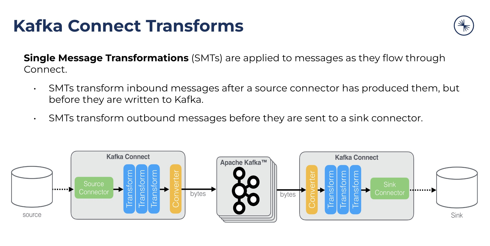

# 🧑‍🎓 Playground Academy

Below is a collection of use cases/issues for which a reproduction model was done using the playground.

Each example (categorized by difficulty) is composed of:

* 🔥 A small description of the issue.
* 🤯 A detailed description with all required information.
* 📍 Series of step to follow. An (optional) solution for each step is provided in following step.
* 🌟 Results with a link to the full reproduction model, which can be executed directly using playground.

🧠 The goal is to let users do the reproduction by themselves. This is the only way to learn 😀.

> [!TIP]
> This is the counter of  made with playground so far..
> 


## ⭐ Beginner

### Avro Converter: Unknown magic byte

<!-- tabs:start -->
#### **🔥 Description**

Sink connector is getting "Unknown magic byte" deserialization error.

💡 What you'll learn:

* Understand converter issue
* How to reset offsets
* Understand impact of DLQ

#### **🤯 Details**

Versions used:

* 🎯 CP: 7.5.2

* 🔗 Filestream sink: 7.5.2 (shipped with CP)

> [!TIP] Make sure to be aware of default converters used at worker level, see [↔️ Default Connect converter used](/how-it-works?id=%e2%86%94%ef%b8%8f-default-connect-converter-used)

#### **📍 Step 1**

Run the example `filestream-sink-repro-000002-deserialization-error.sh` (use `fzf` completion to find the example with `-f`):

```bash
playground run -f 000002<tab> --tag 7.5.2
```

As you can see, connector is failing (check output of `playground connector status`)

❔Questions:

* Do you know why it is failing ?
* Do you know how it could have been avoided ?

#### **📍 Step 2**
<!-- select:start -->
<!-- select-menu-labels: 🙋 See solution for previous step ? -->
#### --No--
#### --Yes--

> Do you know why it is failing ?

💡 Explanations:

Connector is configured with AvroConverter for the value (default converters are documented [there](/how-it-works?id=%e2%86%94%ef%b8%8f-default-connect-converter-used)):

```json
"value.converter": "io.confluent.connect.avro.AvroConverter",
"value.converter.schema.registry.url": "http://schema-registry:8081"
```

The 3 first requests are sent using Avro as we provide an avro schema as input of [playground topic produce](/playground%20topic%20produce) (`kafka-avro-console-producer` is used under the hood):

```bash
playground topic produce -t filestream --nb-messages 3 --verbose << 'EOF'
{"type":"record","name":"myrecord","fields":[{"name":"u_name","type":"string"},{"name":"u_price", "type": "float"}, {"name":"u_quantity", "type": "int"}]}
EOF
```

This is fine.

But 4th message is sent without schema, so simple json will be sent (`kafka-console-producer` is used under the hood):

```bash
playground topic produce -t filestream --nb-messages 1 --verbose << 'EOF'
{"u_name": "poison pill", "u_price": 1.75, "u_quantity": 1}
EOF
```

So this is not AVRO, it is only sending plain JSON string. That's what we call a *poison pill*.

This is why avro converter fails with `Unknown magic byte` since 4th message does not contain in the first 4 bytes the avro schema id.

> Do you know how it could have been avoided ?

One way to avoid this situation is to enable Confluent feature [Broker-side Schema ID Validation](https://docs.confluent.io/platform/7.4/schema-registry/schema-validation.html).
If this is setup, the 4th message would have been rejected by broker validation.


<!-- select:end -->

* Skip the 4th message (also called *poison pill*) by resetting consumer offset using `kafka-consumer-groups` CLI 

> [!TIP] If you're Confluent customer, check this [Knowledge Base article](https://support.confluent.io/hc/en-us/articles/360031115091-How-to-skip-messages-in-Kafka-Connect-or-reset-a-connector-to-the-earliest-offset-for-sink-connectors)

Here is an example of how you can use the CLI (in this case it is to reset to earliest, update it to reset to specific offset in order to skip poison pill):

```bash
docker exec broker kafka-consumer-groups --bootstrap-server broker:9092 --group connect-<connector name> --describe
docker exec broker kafka-consumer-groups --bootstrap-server broker:9092 --group connect-<connector name> --to-earliest --topic a-topic --reset-offsets --dry-run
docker exec broker kafka-consumer-groups --bootstrap-server broker:9092 --group connect-<connector name> --to-earliest --topic a-topic --reset-offsets --execute
```

> [!TIP] You can check offset and partition using `playground topic consume`

```bash
playground topic consume                                                
16:15:08 ℹ️ ✨ --topic flag was not provided, applying command to all topics
16:15:13 ℹ️ ✨ Display content of topic filestream, it contains 5 messages
16:15:13 ℹ️ 🔮🙅 topic is not using any schema for key
16:15:13 ℹ️ 🔮🔰 topic is using avro for value
16:15:14 ℹ️ 🔰 subject filestream-value 💯 version 1 (id 1)
{
  "type": "record",
  "name": "myrecord",
  "fields": [
    {
      "name": "u_name",
      "type": "string"
    },
    {
      "name": "u_price",
      "type": "float"
    },
    {
      "name": "u_quantity",
      "type": "int"
    }
  ]
}
CreateTime:2023-12-19 16:14:19.296|Partition:0|Offset:0|Headers:NO_HEADERS|Key:null|Value:{"u_name":"Neil","u_price":0.25018042,"u_quantity":1}|ValueSchemaId:1
CreateTime:2023-12-19 16:14:19.315|Partition:0|Offset:1|Headers:NO_HEADERS|Key:null|Value:{"u_name":"Gertrude","u_price":0.5933151,"u_quantity":2}|ValueSchemaId:1
CreateTime:2023-12-19 16:14:19.315|Partition:0|Offset:2|Headers:NO_HEADERS|Key:null|Value:{"u_name":"Hazle","u_price":0.4817881,"u_quantity":3}|ValueSchemaId:1
CreateTime:2023-12-19 16:14:29.232|Partition:0|Offset:3|Headers:NO_HEADERS|Key:null|Value:[2023-12-19 15:15:19,624] ERROR Error processing message, skipping this message:  (kafka.tools.ConsoleConsumer$)|ValueSchemaId:
org.apache.kafka.common.errors.SerializationException: Unknown magic byte!
at io.confluent.kafka.serializers.AbstractKafkaSchemaSerDe.getByteBuffer(AbstractKafkaSchemaSerDe.java:600)
at io.confluent.kafka.serializers.AbstractKafkaAvroDeserializer$DeserializationContext.<init>(AbstractKafkaAvroDeserializer.java:389)
at io.confluent.kafka.serializers.AbstractKafkaAvroDeserializer.deserialize(AbstractKafkaAvroDeserializer.java:187)
at io.confluent.kafka.formatter.AvroMessageFormatter$AvroMessageDeserializer.deserialize(AvroMessageFormatter.java:134)
at io.confluent.kafka.formatter.AvroMessageFormatter.writeTo(AvroMessageFormatter.java:89)
at io.confluent.kafka.formatter.SchemaMessageFormatter.writeTo(SchemaMessageFormatter.java:266)
at kafka.tools.ConsoleConsumer$.process(ConsoleConsumer.scala:117)
at kafka.tools.ConsoleConsumer$.run(ConsoleConsumer.scala:77)
at kafka.tools.ConsoleConsumer$.main(ConsoleConsumer.scala:54)
at kafka.tools.ConsoleConsumer.main(ConsoleConsumer.scala)
CreateTime:2023-12-19 16:14:44.581|Partition:0|Offset:4|Headers:NO_HEADERS|Key:null|Value:{"u_name":"Eulalia","u_price":0.17915314,"u_quantity":1}|ValueSchemaId:1
```

Poison pill is at `Partition:0|Offset:3`

#### **📍 Step 3**
<!-- select:start -->
<!-- select-menu-labels: 🙋 See solution for previous step ? -->
#### --No--
#### --Yes--

The output of describe command is:

```bash
docker exec broker kafka-consumer-groups --bootstrap-server broker:9092 --group connect-filestream-sink --describe
Consumer group 'connect-filestream-sink' has no active members.
```

This is because the connector task is in FAILED state.

In order to reset offset, the consumer group should not have any active members (in case connector is RUNNING, a common approach is to delete the connector, then reset offset, and then re-create connector), so we're good to proceed with reset offset here.

Reset offset to 4 (dry-run):

```bash
docker exec broker kafka-consumer-groups --bootstrap-server broker:9092 --group connect-filestream-sink --to-offset 4 --topic filestream --reset-offsets --dry-run

GROUP                          TOPIC                          PARTITION  NEW-OFFSET     
connect-filestream-sink        filestream                     0          4  
```

All good, do it !

```bash
docker exec broker kafka-consumer-groups --bootstrap-server broker:9092 --group connect-filestream-sink --to-offset 4 --topic filestream --reset-offsets --execute

GROUP                          TOPIC                          PARTITION  NEW-OFFSET     
connect-filestream-sink        filestream                     0          4         
```

Restart connector now:

```bash
playground connector restart
```

Verify connector is now running

```bash
playground connector status
```

Check data was processed:

```bash
docker exec connect cat /tmp/output.json
Struct{u_name=bottle,u_price=2.75,u_quantity=3}
```

Note: First 3 records were skipped, filestream connector is very basic, so not handling this issue very well..

<!-- select:end -->
👉 Now add a DLQ and re-run the example

To add DLQ, add this in connector config:

```json
"errors.tolerance": "all",
"errors.deadletterqueue.topic.name": "dlq",
"errors.deadletterqueue.topic.replication.factor": "1",
"errors.deadletterqueue.context.headers.enable": "true",
"errors.log.enable": "true",
"errors.log.include.messages": "true",
```

> [!TIP] to run again the example, just use `playground re-run`

See the difference in behavior.

> [!TIP] To check content of topic (by default all non-internal topics will be displayed), just use `playground topic consume`

#### **📍 Step 4**
<!-- select:start -->
<!-- select-menu-labels: 🙋 See solution for previous step ? -->
#### --No--
#### --Yes--

Poison pill is going to DLQ:

```bash
16:21:56 ℹ️ ✨ Display content of topic dlq, it contains 1 messages
16:21:57 ℹ️ 🔮🙅 topic is not using any schema for key
16:21:57 ℹ️ 🔮🙅 topic is not using any schema for value
CreateTime:2023-12-19 16:21:19.347|Partition:0|Offset:0|Headers:__connect.errors.topic:filestream,__connect.errors.partition:0,__connect.errors.offset:3,__connect.errors.connector.name:filestream-sink,__connect.errors.task.id:0,__connect.errors.stage:VALUE_CONVERTER,__connect.errors.class.name:io.confluent.connect.avro.AvroConverter,__connect.errors.exception.class.name:org.apache.kafka.connect.errors.DataException,__connect.errors.exception.message:Failed to deserialize data for topic filestream to Avro: ,__connect.errors.exception.stacktrace:org.apache.kafka.connect.errors.DataException: Failed to deserialize data for topic filestream to Avro:|Key:|Value:|ValueSchemaId:
at io.confluent.connect.avro.AvroConverter.toConnectData(AvroConverter.java:148)
at org.apache.kafka.connect.runtime.WorkerSinkTask.lambda$convertAndTransformRecord$5(WorkerSinkTask.java:528)
at org.apache.kafka.connect.runtime.errors.RetryWithToleranceOperator.execAndRetry(RetryWithToleranceOperator.java:190)
at org.apache.kafka.connect.runtime.errors.RetryWithToleranceOperator.execAndHandleError(RetryWithToleranceOperator.java:224)
at org.apache.kafka.connect.runtime.errors.RetryWithToleranceOperator.execute(RetryWithToleranceOperator.java:166)
at org.apache.kafka.connect.runtime.WorkerSinkTask.convertAndTransformRecord(WorkerSinkTask.java:528)
at org.apache.kafka.connect.runtime.WorkerSinkTask.convertMessages(WorkerSinkTask.java:503)
at org.apache.kafka.connect.runtime.WorkerSinkTask.poll(WorkerSinkTask.java:339)
at org.apache.kafka.connect.runtime.WorkerSinkTask.iteration(WorkerSinkTask.java:238)
at org.apache.kafka.connect.runtime.WorkerSinkTask.execute(WorkerSinkTask.java:207)
at org.apache.kafka.connect.runtime.WorkerTask.doRun(WorkerTask.java:229)
at org.apache.kafka.connect.runtime.WorkerTask.run(WorkerTask.java:284)
at org.apache.kafka.connect.runtime.isolation.Plugins.lambda$withClassLoader$1(Plugins.java:181)
at java.base/java.util.concurrent.Executors$RunnableAdapter.call(Executors.java:515)
at java.base/java.util.concurrent.FutureTask.run(FutureTask.java:264)
at java.base/java.util.concurrent.ThreadPoolExecutor.runWorker(ThreadPoolExecutor.java:1128)
at java.base/java.util.concurrent.ThreadPoolExecutor$Worker.run(ThreadPoolExecutor.java:628)
at java.base/java.lang.Thread.run(Thread.java:829)
Caused by: org.apache.kafka.common.errors.SerializationException: Unknown magic byte!
at io.confluent.kafka.serializers.AbstractKafkaSchemaSerDe.getByteBuffer(AbstractKafkaSchemaSerDe.java:600)
at io.confluent.kafka.serializers.AbstractKafkaAvroDeserializer$DeserializationContext.<init>(AbstractKafkaAvroDeserializer.java:389)
at io.confluent.kafka.serializers.AbstractKafkaAvroDeserializer.deserializeWithSchemaAndVersion(AbstractKafkaAvroDeserializer.java:264)
at io.confluent.connect.avro.AvroConverter$Deserializer.deserialize(AvroConverter.java:199)
at io.confluent.connect.avro.AvroConverter.toConnectData(AvroConverter.java:126)
... 17 more
|null|{"u_name":"poison pill","u_price":1.75,"u_quantity":1}
```

And connector is RUNNING:

```bash
playground connector status 
11:26:47 ℹ️ 🧩 Displaying connector(s) status
Name                           Status       Tasks                          Stack Trace                                       
-------------------------------------------------------------------------------------------------------------
filestream-sink                ✅ RUNNING  0:🟢 RUNNING                 -                                                 
-------------------------------------------------------------------------------------------------------------
```

<!-- select:end -->
🥁 So...did you learn about converter issues (Unknown magic byte) ?

#### **🎓 Next Steps**

* Read [Kafka Connect Deep Dive – Error Handling and Dead Letter Queues](https://www.confluent.io/en-gb/blog/kafka-connect-deep-dive-error-handling-dead-letter-queues/) and plays with different config parameters.
* Update example to enable [Broker-side Schema ID Validation](https://docs.confluent.io/platform/7.4/schema-registry/schema-validation.html)

Tips: you'll need to update docker-compose file to add 

```yml

  broker:
    environment:
      KAFKA_CONFLUENT_SCHEMA_REGISTRY_URL: "https://schema-registry:8081"
```

After doing that, you can call [playground container recreate](/playground%20container%20recreate) to apply modifications and restart broker.

* `Unknown magic byte` is when using AVRO. You can also test with JSON Schema and Protobuf to see the differences in stack traces, error messages.

To produce JSON Schema data, just use [playground topic produce](/playground%20topic%20produce) with a json schema (use a new topic!) and make sure to change connector config with:

```json
"value.converter": "io.confluent.connect.json.JsonSchemaConverter",
"value.converter.schema.registry.url": "http://schema-registry:8081",
```

To produce Protobuf data, just use [playground topic produce](/playground%20topic%20produce) with a protobuf schema (use a new topic!) and make sure to change connector config with:

```json
"value.converter": "io.confluent.connect.protobuf.ProtobufConverter",
"value.converter.schema.registry.url": "http://schema-registry:8081",
```

<!-- tabs:end -->


### InsertField SMT: DataException: Only Struct objects supported (sink connector)

<!-- tabs:start -->
#### **🔥 Description**

Sink connector is getting "Only Struct objects supported for [field insertion], found: java.lang.String" SMT error when using [InsertField](https://docs.confluent.io/platform/current/connect/transforms/insertfield.html) SMT.

```bash
org.apache.kafka.connect.errors.DataException: Only Struct objects supported for [field insertion], found: java.lang.String
```

💡 What you'll learn:

* Understand SMT issue
* Understand impact of DLQ on SMT

#### **🤯 Details**

Versions used:

* 🎯 CP: 7.5.2

* 🔗 Filestream sink: 7.5.2 (shipped with CP)

> [!TIP] Make sure to be aware of default converters used at worker level, see [↔️ Default Connect converter used](/how-it-works?id=%e2%86%94%ef%b8%8f-default-connect-converter-used)

Full stack trace:

```bash
[2023-05-22 13:28:13,246] ERROR [filestream-sink|task-0] WorkerSinkTask{id=filestream-sink-0} Task threw an uncaught and unrecoverable exception. Task is being killed and will not recover until manually restarted (org.apache.kafka.connect.runtime.WorkerTask:221)
org.apache.kafka.connect.errors.ConnectException: Tolerance exceeded in error handler
        at org.apache.kafka.connect.runtime.errors.RetryWithToleranceOperator.execAndHandleError(RetryWithToleranceOperator.java:244)
        at org.apache.kafka.connect.runtime.errors.RetryWithToleranceOperator.execute(RetryWithToleranceOperator.java:166)
        at org.apache.kafka.connect.runtime.TransformationChain.transformRecord(TransformationChain.java:70)
        at org.apache.kafka.connect.runtime.TransformationChain.apply(TransformationChain.java:50)
        at org.apache.kafka.connect.runtime.WorkerSinkTask.convertAndTransformRecord(WorkerSinkTask.java:549)
        at org.apache.kafka.connect.runtime.WorkerSinkTask.convertMessages(WorkerSinkTask.java:500)
        at org.apache.kafka.connect.runtime.WorkerSinkTask.poll(WorkerSinkTask.java:336)
        at org.apache.kafka.connect.runtime.WorkerSinkTask.iteration(WorkerSinkTask.java:238)
        at org.apache.kafka.connect.runtime.WorkerSinkTask.execute(WorkerSinkTask.java:207)
        at org.apache.kafka.connect.runtime.WorkerTask.doRun(WorkerTask.java:213)
        at org.apache.kafka.connect.runtime.WorkerTask.run(WorkerTask.java:268)
        at org.apache.kafka.connect.runtime.isolation.Plugins.lambda$withClassLoader$1(Plugins.java:177)
        at java.base/java.util.concurrent.Executors$RunnableAdapter.call(Executors.java:515)
        at java.base/java.util.concurrent.FutureTask.run(FutureTask.java:264)
        at java.base/java.util.concurrent.ThreadPoolExecutor.runWorker(ThreadPoolExecutor.java:1128)
        at java.base/java.util.concurrent.ThreadPoolExecutor$Worker.run(ThreadPoolExecutor.java:628)
        at java.base/java.lang.Thread.run(Thread.java:829)
Caused by: org.apache.kafka.connect.errors.DataException: Only Struct objects supported for [field insertion], found: java.lang.String
        at org.apache.kafka.connect.transforms.util.Requirements.requireStruct(Requirements.java:52)
        at org.apache.kafka.connect.transforms.InsertField.applyWithSchema(InsertField.java:164)
        at org.apache.kafka.connect.transforms.InsertField.apply(InsertField.java:135)
        at org.apache.kafka.connect.runtime.TransformationChain.lambda$transformRecord$0(TransformationChain.java:70)
        at org.apache.kafka.connect.runtime.errors.RetryWithToleranceOperator.execAndRetry(RetryWithToleranceOperator.java:190)
        at org.apache.kafka.connect.runtime.errors.RetryWithToleranceOperator.execAndHandleError(RetryWithToleranceOperator.java:224)
        ... 16 more
```

#### **📍 Step 1**

Run the example `filestream-sink-repro-000003-insertfield-smt-dataexception-only-struct-objects-supported.sh` (use `fzf` completion to find the example with `-f`):

```bash
playground run -f 000003<tab> --tag 7.5.2
```

As you can see, connector is failing (check output of `playground connector status`)

❔Questions:

* Do you know why it is failing ?
* Do you know how it could have been avoided ?

#### **📍 Step 2**
<!-- select:start -->
<!-- select-menu-labels: 🙋 See solution for previous step ? -->
#### --No--
#### --Yes--

> Do you know why it is failing ?

💡 Explanations:

Connector is configured with StringConverter for the value:

```json
"value.converter": "org.apache.kafka.connect.storage.StringConverter",
```

The request is sent using Plain JSON as [playground topic produce](/playground%20topic%20produce) is used without schema (`kafka-console-producer` is used under the hood):

```bash
log "Sending messages to topic filestream"
playground topic produce -t filestream --nb-messages 1 --verbose << 'EOF'
{"customer_name":"Ed", "complaint_type":"Dirty car", "trip_cost": 29.10, "new_customer": false, "number_of_rides": 22}
EOF
```

The SMT InsertField requires a `STRUCT`, but here StringConverter is used which creates a `STRING` hence the issue.

> Do you know how it could have been avoided ?

To avoid this situation is to use JsonConverter converter instead with `schemas.enable=false` (since our data in topic is plain JSON)

```json
"value.converter":"org.apache.kafka.connect.json.JsonConverter",
"value.converter.schemas.enable":"false",
```

<!-- select:end -->

👉 Now add a DLQ and re-run the example

To add DLQ, add this in connector config:

```json
"errors.tolerance": "all",
"errors.deadletterqueue.topic.name": "dlq",
"errors.deadletterqueue.topic.replication.factor": "1",
"errors.deadletterqueue.context.headers.enable": "true",
"errors.log.enable": "true",
"errors.log.include.messages": "true",
```

> [!TIP] to run again the example, just use `playground re-run`

See the difference in behavior.

> [!TIP] To check content of topic (by default all non-internal topics will be displayed), just use `playground topic consume`


#### **📍 Step 3**
<!-- select:start -->
<!-- select-menu-labels: 🙋 See solution for previous step ? -->
#### --No--
#### --Yes--


Record is going to DLQ:

```bash
$ playground topic consume 
15:55:55 ℹ️ ✨ --topic flag was not provided, applying command to all topics
15:55:57 ℹ️ ✨ Display content of topic dlq, it contains 1 messages
15:55:57 ℹ️ 🔮🙅 topic is not using any schema for key
15:55:57 ℹ️ 🔮🙅 topic is not using any schema for value
CreateTime: 2023-05-22 15:54:46.681|Partition:0|Offset:0|__connect.errors.topic:filestream,__connect.errors.partition:0,__connect.errors.offset:0,__connect.errors.connector.name:filestream-sink,__connect.errors.task.id:0,__connect.errors.stage:TRANSFORMATION,__connect.errors.class.name:org.apache.kafka.connect.transforms.InsertField$Value,__connect.errors.exception.class.name:org.apache.kafka.connect.errors.DataException,__connect.errors.exception.message:Only Struct objects supported for [field insertion], found: java.lang.String,__connect.errors.exception.stacktrace:org.apache.kafka.connect.errors.DataException: Only Struct objects supported for [field insertion], found: java.lang.String
at org.apache.kafka.connect.transforms.util.Requirements.requireStruct(Requirements.java:52)
at org.apache.kafka.connect.transforms.InsertField.applyWithSchema(InsertField.java:164)
at org.apache.kafka.connect.transforms.InsertField.apply(InsertField.java:135)
at org.apache.kafka.connect.runtime.TransformationChain.lambda$transformRecord$0(TransformationChain.java:70)
at org.apache.kafka.connect.runtime.errors.RetryWithToleranceOperator.execAndRetry(RetryWithToleranceOperator.java:190)
at org.apache.kafka.connect.runtime.errors.RetryWithToleranceOperator.execAndHandleError(RetryWithToleranceOperator.java:224)
at org.apache.kafka.connect.runtime.errors.RetryWithToleranceOperator.execute(RetryWithToleranceOperator.java:166)
at org.apache.kafka.connect.runtime.TransformationChain.transformRecord(TransformationChain.java:70)
at org.apache.kafka.connect.runtime.TransformationChain.apply(TransformationChain.java:50)
at org.apache.kafka.connect.runtime.WorkerSinkTask.convertAndTransformRecord(WorkerSinkTask.java:549)
at org.apache.kafka.connect.runtime.WorkerSinkTask.convertMessages(WorkerSinkTask.java:500)
at org.apache.kafka.connect.runtime.WorkerSinkTask.poll(WorkerSinkTask.java:336)
at org.apache.kafka.connect.runtime.WorkerSinkTask.iteration(WorkerSinkTask.java:238)
at org.apache.kafka.connect.runtime.WorkerSinkTask.execute(WorkerSinkTask.java:207)
at org.apache.kafka.connect.runtime.WorkerTask.doRun(WorkerTask.java:213)
at org.apache.kafka.connect.runtime.WorkerTask.run(WorkerTask.java:268)
at org.apache.kafka.connect.runtime.isolation.Plugins.lambda$withClassLoader$1(Plugins.java:177)
at java.base/java.util.concurrent.Executors$RunnableAdapter.call(Executors.java:515)
at java.base/java.util.concurrent.FutureTask.run(FutureTask.java:264)
at java.base/java.util.concurrent.ThreadPoolExecutor.runWorker(ThreadPoolExecutor.java:1128)
at java.base/java.util.concurrent.ThreadPoolExecutor$Worker.run(ThreadPoolExecutor.java:628)
at java.base/java.lang.Thread.run(Thread.java:829)
|null|{"customer_name":"Ed", "complaint_type":"Dirty car", "trip_cost": 29.10, "new_customer": false, "number_of_rides": 22}
15:56:04 ℹ️ ✨ Display content of topic filestream, it contains 1 messages
15:56:04 ℹ️ 🔮🙅 topic is not using any schema for key
15:56:04 ℹ️ 🔮🙅 topic is not using any schema for value
```

And connector is RUNNING:

```bash
playground connector status 
15:56:30 ℹ️ 🧩 Displaying connector(s) status
Name                           Status       Tasks (Worker ID)                                            Stack Trace                                       
-----------------------------------------------------------------------------------------------------------------------------
filestream-sink                ✅ RUNNING  0:🟢 RUNNING[connect]        -                                                 
-------------------------------------------------------------------------------------------------------------
```

<!-- select:end -->
Fix the issue by choosing the right converter

#### **📍 Step 4**
<!-- select:start -->
<!-- select-menu-labels: 🙋 See solution for previous step ? -->
#### --No--
#### --Yes--


Replace:

```json
"value.converter": "org.apache.kafka.connect.storage.StringConverter",
```

by 

```json
"value.converter":"org.apache.kafka.connect.json.JsonConverter",
"value.converter.schemas.enable":"false",
```

And redeploy the connector (just copy/paste the updated curl command in your terminal)

Verify connector is now running

```bash
playground connector status
```

Check data was processed:

```bash
docker exec connect cat /tmp/output.json
{trip_cost=29.1, MessageSource=Kafka Connect framework, complaint_type=Dirty car, customer_name=Ed, new_customer=false, number_of_rides=22}
```

As you can see the InsertField SMT worked in that case and field `MessageSource=Kafka Connect framework` was added.

```json
"transforms": "InsertField",
"transforms.InsertField.type": "org.apache.kafka.connect.transforms.InsertField\$Value",
"transforms.InsertField.static.field": "MessageSource",
"transforms.InsertField.static.value": "Kafka Connect framework"
```
<!-- select:end -->
Test InsertField SMT with different [properties](https://docs.confluent.io/platform/current/connect/transforms/insertfield.html#properties), include:

* topic
* offset
* partition
* timestamp


#### **📍 Step 5**
<!-- select:start -->
<!-- select-menu-labels: 🙋 See solution for previous step ? -->
#### --No--
#### --Yes--

Use the following SMT config (make sure that *JsonConverter* is still being used!):

```json
"transforms": "InsertTopic,InsertOffset,InsertPartition,InsertTimestamp"
"transforms.InsertOffset.offset.field": "__kafka_offset",
"transforms.InsertOffset.type": "org.apache.kafka.connect.transforms.InsertField\$Value",
"transforms.InsertPartition.partition.field": "__kafka_partition",
"transforms.InsertPartition.type": "org.apache.kafka.connect.transforms.InsertField\$Value",
"transforms.InsertTimestamp.timestamp.field": "__kafka_ts",
"transforms.InsertTimestamp.type": "org.apache.kafka.connect.transforms.InsertField\$Value",
"transforms.InsertTopic.topic.field": "__kafka_topic",
"transforms.InsertTopic.type": "org.apache.kafka.connect.transforms.InsertField\$Value",
```

Send one more record:

```bash
playground topic produce -t filestream --nb-messages 1 --verbose << 'EOF'
{"customer_name":"Ed", "complaint_type":"Dirty car", "trip_cost": 29.10, "new_customer": false, "number_of_rides": 22}
EOF
```

Check the output of json file:

```bash
log "Verify we have received the data in file"
docker exec connect cat /tmp/output.json
{__kafka_topic=filestream, __kafka_partition=0, complaint_type=Dirty car, new_customer=false, __kafka_offset=2, __kafka_ts=1684764616428, trip_cost=29.1, customer_name=Ed, number_of_rides=22}
```

<!-- select:end -->
Change format of `__kafka_ts` field to make it human readable, i.e instead of Unix number, use format `yyyy-MM-dd HH:mm:ss.SSS`

> [!TIP] Use [TimestampConverter](https://docs.confluent.io/platform/current/connect/transforms/timestampconverter.html#) SMT to do this conversion
> Be careful with order of SMTs when you add TimestampConverter !

#### **📍 Step 6**
<!-- select:start -->
<!-- select-menu-labels: 🙋 See solution for previous step ? -->
#### --No--
#### --Yes--

Add `TimestampConverter` (you can use any string) at the end of the existing list (or just make sure to add it after `InsertTimestamp`):

```json
"transforms": "InsertTopic,InsertOffset,InsertPartition,InsertTimestamp,TimestampConverter",
```

And then add:

```json
"transforms.TimestampConverter.type": "org.apache.kafka.connect.transforms.TimestampConverter\$Value",
"transforms.TimestampConverter.format": "yyyy-MM-dd HH:mm:ss.SSS",
"transforms.TimestampConverter.target.type": "string",
"transforms.TimestampConverter.field": "__kafka_ts",
```

It will convert field `__kafka_ts` to a string with format `yyyy-MM-dd HH:mm:ss.SSS`.

Send one more record:

```bash
playground topic produce -t filestream --nb-messages 1 --verbose << 'EOF'
{"customer_name":"Ed", "complaint_type":"Dirty car", "trip_cost": 29.10, "new_customer": false, "number_of_rides": 22}
EOF
```

Check the output of json file:

```bash
log "Verify we have received the data in file"
docker exec connect cat /tmp/output.json
{__kafka_topic=filestream, __kafka_partition=0, complaint_type=Dirty car, new_customer=false, __kafka_offset=3, __kafka_ts=2023-05-22 14:14:27.068, trip_cost=29.1, customer_name=Ed, number_of_rides=22}
```

As you can see, the date/time is now human readable:

```json
__kafka_ts=2023-05-22 14:14:27.068
```

<!-- select:end -->
🥁 So...did you learn about SMT issue ?


#### **🎓 Next Steps**

* Read [🎄 Twelve Days of SMT 🎄 - Day 1: InsertField](https://rmoff.net/2020/12/08/twelve-days-of-smt-day-1-insertfield-timestamp/)


<!-- tabs:end -->

### InsertField SMT: DataException: Only Struct objects supported (source connector)

<!-- tabs:start -->
#### **🔥 Description**

Source connector is getting "Only Struct objects supported for [field insertion], found: java.lang.String" SMT error when using [InsertField](https://docs.confluent.io/platform/current/connect/transforms/insertfield.html) SMT.

```bash
org.apache.kafka.connect.errors.DataException: Only Struct objects supported for [field insertion], found: java.lang.String
```

💡 What you'll learn:

* Understand difference between source & sink connectors when dealing with SMT issue.

#### **🤯 Details**

Versions used:

* 🎯 CP: 7.5.2

* 🔗 Filestream source: 7.5.2 (shipped with CP)

> [!TIP] Make sure to be aware of default converters used at worker level, see [↔️ Default Connect converter used](/how-it-works?id=%e2%86%94%ef%b8%8f-default-connect-converter-used)

Full stack trace:

```bash
[2023-05-22 14:36:19,975] ERROR [filestream-source|task-0] WorkerSourceTask{id=filestream-source-0} Task threw an uncaught and unrecoverable exception. Task is being killed and will not recover until manually restarted (org.apache.kafka.connect.runtime.WorkerTask:221)
org.apache.kafka.connect.errors.ConnectException: Tolerance exceeded in error handler
        at org.apache.kafka.connect.runtime.errors.RetryWithToleranceOperator.execAndHandleError(RetryWithToleranceOperator.java:244)
        at org.apache.kafka.connect.runtime.errors.RetryWithToleranceOperator.execute(RetryWithToleranceOperator.java:166)
        at org.apache.kafka.connect.runtime.TransformationChain.transformRecord(TransformationChain.java:70)
        at org.apache.kafka.connect.runtime.TransformationChain.apply(TransformationChain.java:50)
        at org.apache.kafka.connect.runtime.AbstractWorkerSourceTask.sendRecords(AbstractWorkerSourceTask.java:400)
        at org.apache.kafka.connect.runtime.AbstractWorkerSourceTask.execute(AbstractWorkerSourceTask.java:364)
        at org.apache.kafka.connect.runtime.WorkerTask.doRun(WorkerTask.java:213)
        at org.apache.kafka.connect.runtime.WorkerTask.run(WorkerTask.java:268)
        at org.apache.kafka.connect.runtime.AbstractWorkerSourceTask.run(AbstractWorkerSourceTask.java:78)
        at org.apache.kafka.connect.runtime.isolation.Plugins.lambda$withClassLoader$1(Plugins.java:177)
        at java.base/java.util.concurrent.Executors$RunnableAdapter.call(Executors.java:515)
        at java.base/java.util.concurrent.FutureTask.run(FutureTask.java:264)
        at java.base/java.util.concurrent.ThreadPoolExecutor.runWorker(ThreadPoolExecutor.java:1128)
        at java.base/java.util.concurrent.ThreadPoolExecutor$Worker.run(ThreadPoolExecutor.java:628)
        at java.base/java.lang.Thread.run(Thread.java:829)
Caused by: org.apache.kafka.connect.errors.DataException: Only Struct objects supported for [field insertion], found: java.lang.String
        at org.apache.kafka.connect.transforms.util.Requirements.requireStruct(Requirements.java:52)
        at org.apache.kafka.connect.transforms.InsertField.applyWithSchema(InsertField.java:164)
        at org.apache.kafka.connect.transforms.InsertField.apply(InsertField.java:135)
        at org.apache.kafka.connect.runtime.TransformationChain.lambda$transformRecord$0(TransformationChain.java:70)
        at org.apache.kafka.connect.runtime.errors.RetryWithToleranceOperator.execAndRetry(RetryWithToleranceOperator.java:190)
        at org.apache.kafka.connect.runtime.errors.RetryWithToleranceOperator.execAndHandleError(RetryWithToleranceOperator.java:224)
        ... 14 more
```

#### **📍 Step 1**

Run the example `filestream-source-repro-000004-insertfield-smt-dataexception-only-struct-objects-supported.sh` (use `fzf` completion to find the example with `-f`):

```bash
playground run -f 000004<tab> --tag 7.5.2
```

As you can see, connector is failing (check output of `playground connector status`)

❔Questions:

* Do you know why it is failing ?
* Do you know how it could have been avoided ?

#### **📍 Step 2**
<!-- select:start -->
<!-- select-menu-labels: 🙋 See solution for previous step ? -->
#### --No--
#### --Yes--

> Do you know why it is failing ?

💡 Explanations:

Despite connector configured with JsonConverter for the value, which was the way to fix the problem with sink example:

```json
"value.converter":"org.apache.kafka.connect.json.JsonConverter",
"value.converter.schemas.enable":"false",
```

The connector is still failing...

The SMT InsertField requires a `STRUCT`, but here the FileStream connector's logic create the ConnectRecord with a schema which is just a `STRING`, not a `STRUCT`:

```log
[2023-05-22 14:36:19,973] ERROR [filestream-source|task-0] Error encountered in task filestream-source-0. Executing stage 'TRANSFORMATION' with class 'org.apache.kafka.connect.transforms.InsertField$Value', where source record is = SourceRecord{sourcePartition={filename=/tmp/kafka-connect/examples/file.json}, sourceOffset={position=232}} ConnectRecord{topic='filestream', kafkaPartition=null, key=null, keySchema=null, value={"id":1,"first_name":"Jenelle","last_name":"Fick","email":"jfick0@census.gov","gender":"Female","ip_address":"158.201.163.89","last_login":"2019-04-03T05:49:31Z","account_balance":22810.68,"country":"PH","favorite_color":"#5ebf9d"}, valueSchema=Schema{STRING}, timestamp=1684766179966, headers=ConnectHeaders(headers=)}. (org.apache.kafka.connect.runtime.errors.LogReporter:66)
org.apache.kafka.connect.errors.DataException: Only Struct objects supported for [field insertion], found: java.lang.String
```

Note `valueSchema=Schema{STRING}`


> [!TIP] This log trace with `Executing stage 'TRANSFORMATION'` is displayed because the connector has:
>               "errors.log.enable": "true",
>               "errors.log.include.messages": "true",


> Do you know how it could have been avoided ?

You can't avoid it, the problem here is that connector is only creating ConnectRecord with STRING schema.

As you can see below, for source connector, the SMT is applied after the source connector logic, so nothing can be done as the record is not meeting the InsertField SMT requirements here.



Please also note that converter is called after SMT, so for source connector, it is not relevant at all here (as opposed to sink connectors).

<!-- select:end -->
🥁 So...did you learn about SMT issue and difference between source and sink connectors ?


#### **🎓 Next Steps**

* You can run an example with a connector that creates records with STRUCT, for example JDBC source, and then use InsertField and makes sure it works as expected


<!-- tabs:end -->


### InsertField SMT: adding topic, offset and partition not working

<!-- tabs:start -->
#### **🔥 Description**

When using [InsertField](https://docs.confluent.io/platform/current/connect/transforms/insertfield.html) SMT to add topic, offset and partition with source connector, it does not work as expected.


💡 What you'll learn:

* Understand difference between source & sink connectors when dealing with SMT issue.

#### **🤯 Details**

Versions used:

* 🎯 CP: 7.5.2

* 🔗 Filestream source: 7.5.2 (shipped with CP)

> [!TIP] Make sure to be aware of default converters used at worker level, see [↔️ Default Connect converter used](/how-it-works?id=%e2%86%94%ef%b8%8f-default-connect-converter-used)

Full stack trace:

```bash
[2023-05-22 15:02:04,397] ERROR [mysql-source|task-0] WorkerSourceTask{id=mysql-source-0} Task threw an uncaught and unrecoverable exception. Task is being killed and will not recover until manually restarted (org.apache.kafka.connect.runtime.WorkerTask:221)
org.apache.kafka.connect.errors.ConnectException: Tolerance exceeded in error handler
        at org.apache.kafka.connect.runtime.errors.RetryWithToleranceOperator.execAndHandleError(RetryWithToleranceOperator.java:244)
        at org.apache.kafka.connect.runtime.errors.RetryWithToleranceOperator.execute(RetryWithToleranceOperator.java:166)
        at org.apache.kafka.connect.runtime.TransformationChain.transformRecord(TransformationChain.java:70)
        at org.apache.kafka.connect.runtime.TransformationChain.apply(TransformationChain.java:50)
        at org.apache.kafka.connect.runtime.AbstractWorkerSourceTask.sendRecords(AbstractWorkerSourceTask.java:400)
        at org.apache.kafka.connect.runtime.AbstractWorkerSourceTask.execute(AbstractWorkerSourceTask.java:364)
        at org.apache.kafka.connect.runtime.WorkerTask.doRun(WorkerTask.java:213)
        at org.apache.kafka.connect.runtime.WorkerTask.run(WorkerTask.java:268)
        at org.apache.kafka.connect.runtime.AbstractWorkerSourceTask.run(AbstractWorkerSourceTask.java:78)
        at org.apache.kafka.connect.runtime.isolation.Plugins.lambda$withClassLoader$1(Plugins.java:177)
        at java.base/java.util.concurrent.Executors$RunnableAdapter.call(Executors.java:515)
        at java.base/java.util.concurrent.FutureTask.run(FutureTask.java:264)
        at java.base/java.util.concurrent.ThreadPoolExecutor.runWorker(ThreadPoolExecutor.java:1128)
        at java.base/java.util.concurrent.ThreadPoolExecutor$Worker.run(ThreadPoolExecutor.java:628)
        at java.base/java.lang.Thread.run(Thread.java:829)
Caused by: org.apache.kafka.connect.errors.DataException: Only SinkRecord supported for [field insertion], found: org.apache.kafka.connect.source.SourceRecord
        at org.apache.kafka.connect.transforms.util.Requirements.requireSinkRecord(Requirements.java:66)
        at org.apache.kafka.connect.transforms.InsertField.applyWithSchema(InsertField.java:185)
        at org.apache.kafka.connect.transforms.InsertField.apply(InsertField.java:135)
        at org.apache.kafka.connect.runtime.TransformationChain.lambda$transformRecord$0(TransformationChain.java:70)
        at org.apache.kafka.connect.runtime.errors.RetryWithToleranceOperator.execAndRetry(RetryWithToleranceOperator.java:190)
        at org.apache.kafka.connect.runtime.errors.RetryWithToleranceOperator.execAndHandleError(RetryWithToleranceOperator.java:224)
        ... 14 more
```

#### **📍 Step 1**

Run the example `mysql-repro-000005-insertfield-smt:-adding-topic-offset-and-partition-not-working.sh` (use `fzf` completion to find the example with `-f`):

```bash
playground run -f 000005<tab> --tag 7.5.2
```

As you can see, connector is failing (check output of `playground connector status`)

❔Questions:

* Do you know why it is failing ?

#### **📍 Step 2**
<!-- select:start -->
<!-- select-menu-labels: 🙋 See solution for previous step ? -->
#### --No--
#### --Yes--

> Do you know why it is failing ?

💡 Explanations:

Connector is configured with same SMTs as with sink connector example [there](/examples?id=insertfield-smt-dataexception-only-struct-objects-supported-sink-connector).

```json
"transforms": "InsertTopic,InsertOffset,InsertPartition,InsertTimestamp,TimestampConverter",
"transforms.InsertOffset.offset.field": "__kafka_offset",
"transforms.InsertOffset.type": "org.apache.kafka.connect.transforms.InsertField\$Value",
"transforms.InsertPartition.partition.field": "__kafka_partition",
"transforms.InsertPartition.type": "org.apache.kafka.connect.transforms.InsertField\$Value",
"transforms.InsertTimestamp.timestamp.field": "__kafka_ts",
"transforms.InsertTimestamp.type": "org.apache.kafka.connect.transforms.InsertField\$Value",
"transforms.InsertTopic.topic.field": "__kafka_topic",
"transforms.InsertTopic.type": "org.apache.kafka.connect.transforms.InsertField\$Value",
"transforms.TimestampConverter.type": "org.apache.kafka.connect.transforms.TimestampConverter\$Value",
"transforms.TimestampConverter.format": "yyyy-MM-dd HH:mm:ss.SSS",
"transforms.TimestampConverter.target.type": "string",
"transforms.TimestampConverter.field": "__kafka_ts"
```

The connector is failing with `Only SinkRecord supported for [field insertion], found: org.apache.kafka.connect.source.SourceRecord`

We don't know which SMT in the list is failing:

```json
"transforms": "InsertTopic,InsertOffset,InsertPartition,InsertTimestamp,TimestampConverter"
```

So in order to troubleshoot this, you can set TRACE level on `org.apache.kafka.connect.runtime.TransformationChain`

```bash
playground debug log-level set --package "org.apache.kafka.connect.runtime.TransformationChain" --level TRACE
17:08:33 ℹ️ 🧬 Set log level for package org.apache.kafka.connect.runtime.TransformationChain to TRACE
[
  "org.apache.kafka.connect.runtime.TransformationChain"
]
```

Note that using this command will also enable logs on `org.apache.kafka.connect.runtime.TransformationChain`:

```bash
playground connector log-level --level TRACE
```

Another way is to set `--level` when using [playground connector create-or-update](/playground%20ccloud-connector%20create-or-update):

```bash
playground connector create-or-update --connector mysql-source --level TRACE
```

We see then in logs:

```log
[2023-05-22 15:08:37,203] TRACE [mysql-source|task-0] Applying transformation org.apache.kafka.connect.transforms.InsertField$Value to SourceRecord{sourcePartition={protocol=1, table=mydb.team}, sourceOffset={timestamp_nanos=0, incrementing=102, timestamp=1684767720000}} ConnectRecord{topic='mysql-team', kafkaPartition=null, key=null, keySchema=null, value=Struct{id=102,name=another,email=another@apache.org,last_modified=2023-05-22 15:02:00.0}, valueSchema=Schema{team:STRUCT}, timestamp=null, headers=ConnectHeaders(headers=)} (org.apache.kafka.connect.runtime.TransformationChain:47)
[2023-05-22 15:08:37,203] TRACE [mysql-source|task-0] Applying transformation org.apache.kafka.connect.transforms.InsertField$Value to SourceRecord{sourcePartition={protocol=1, table=mydb.team}, sourceOffset={timestamp_nanos=0, incrementing=102, timestamp=1684767720000}} ConnectRecord{topic='mysql-team', kafkaPartition=null, key=null, keySchema=null, value=Struct{id=102,name=another,email=another@apache.org,last_modified=2023-05-22 15:02:00.0,__kafka_topic=mysql-team}, valueSchema=Schema{team:STRUCT}, timestamp=null, headers=ConnectHeaders(headers=)} (org.apache.kafka.connect.runtime.TransformationChain:47)
[2023-05-22 15:08:37,203] ERROR [mysql-source|task-0] Error encountered in task mysql-source-0. Executing stage 'TRANSFORMATION' with class 'org.apache.kafka.connect.transforms.InsertField$Value', where source record is = SourceRecord{sourcePartition={protocol=1, table=mydb.team}, sourceOffset={timestamp_nanos=0, incrementing=102, timestamp=1684767720000}} ConnectRecord{topic='mysql-team', kafkaPartition=null, key=null, keySchema=null, value=Struct{id=102,name=another,email=another@apache.org,last_modified=2023-05-22 15:02:00.0}, valueSchema=Schema{team:STRUCT}, timestamp=null, headers=ConnectHeaders(headers=)}. (org.apache.kafka.connect.runtime.errors.LogReporter:66)
```

So it's failing at 2nd SMT in the list, which is `InsertOffset`


<!-- select:end -->

Remove `InsertOffset` SMT and see if that fixes the problem


#### **📍 Step 3**
<!-- select:start -->
<!-- select-menu-labels: 🙋 See solution for previous step ? -->
#### --No--
#### --Yes--

After removing `InsertOffset`:


```json
"transforms": "InsertTopic,InsertPartition,InsertTimestamp,TimestampConverter",
"transforms.InsertPartition.partition.field": "__kafka_partition",
"transforms.InsertPartition.type": "org.apache.kafka.connect.transforms.InsertField\$Value",
"transforms.InsertTimestamp.timestamp.field": "__kafka_ts",
"transforms.InsertTimestamp.type": "org.apache.kafka.connect.transforms.InsertField\$Value",
"transforms.InsertTopic.topic.field": "__kafka_topic",
"transforms.InsertTopic.type": "org.apache.kafka.connect.transforms.InsertField\$Value",
"transforms.TimestampConverter.type": "org.apache.kafka.connect.transforms.TimestampConverter\$Value",
"transforms.TimestampConverter.format": "yyyy-MM-dd HH:mm:ss.SSS",
"transforms.TimestampConverter.target.type": "string",
"transforms.TimestampConverter.field": "__kafka_ts"
```

The connector is no more failing.

<!-- select:end -->

Check the content of the topic with `playground topic consume`

Does that work as you would expect ?

#### **📍 Step 4**
<!-- select:start -->
<!-- select-menu-labels: 🙋 See solution for previous step ? -->
#### --No--
#### --Yes--

> Does that work as you would expect ?

Record's value is:


```json
{
  "id": 102,
  "name": "another",
  "email": "another@apache.org",
  "last_modified": 1684767720000,
  "__kafka_topic": {
    "string": "mysql-team"
  },
  "__kafka_partition": null,
  "__kafka_ts": null
}
```

`__kafka_topic` is set, but not `__kafka_partition` and `__kafka_ts`

As you can see below, for source connector, the SMT is applied after the source connector logic and before sending request to Kafka topic, hence the record's partition and timestamp is completely unknown to SMT, so `null` values are expected.


N.B: For `offset` property it fails with `Only SinkRecord supported for [field insertion], found: org.apache.kafka.connect.source.SourceRecord`, which makes sense. Same check for `partition` and `timestamp` could probably be added  (I don't know why it's not the case)

<!-- select:end -->

🥁 So...did you learn about why InsertField is not setting some fields with source connectors ?


<!-- tabs:end -->


## ⭐⭐ Intermediate

### StackOverflowError with S3 sink connector

<!-- tabs:start -->
#### **🔥 Description**

User is getting StackOverflowError with S3 sink connector. See stack trace in Details section.

💡 What you'll learn:

* [Bootstrap a reproduction model](/reusables?id=%f0%9f%9b%a0-bootstrap-reproduction-model).

#### **🤯 Details**

Versions used:

* 🎯 CP: 7.5.2

* 🔗 S3 sink: 10.3.3

S3 sink config:

```json
{
  "aws.access.key.id": "xxx",
  "aws.secret.access.key": "xxx",
  "connector.class": "io.confluent.connect.s3.S3SinkConnector",
  "errors.log.enable": "true",
  "errors.tolerance": "all",
  "flush.size": "50000",
  "format.class": "io.confluent.connect.s3.format.parquet.ParquetFormat",
  "key.converter": "org.apache.kafka.connect.storage.StringConverter",
  "locale": "de_DE",
  "partitioner.class": "io.confluent.connect.storage.partitioner.DailyPartitioner",
  "rotate.interval.ms": "3600000",
  "s3.bucket.name": "xxx",
  "s3.region": "eu-west-1",
  "storage.class": "io.confluent.connect.s3.storage.S3Storage",
  "tasks.max": "1",
  "timestamp.extractor": "Record",
  "timezone": "UTC",
  "topics.dir": "xxx",
  "topics": "topic1",
  "value.converter.schema.registry.url": "xxx",
  "value.converter": "io.confluent.connect.avro.AvroConverter"
}
```

AVRO schema for topic `topic1` (value):

```json
{
    "type": "record",
    "namespace": "acme",
    "name": "Characteristic",
    "fields": [
        {
            "name": "physicalCharacteristic",
            "type": [
                "null",
                {
                    "type": "record",
                    "name": "PhysicalCharacteristic",
                    "fields": [
                        {
                            "name": "children",
                            "type": [
                                "null",
                                {
                                    "type": "array",
                                    "items": "PhysicalCharacteristic"
                                }
                            ],
                            "default": null
                        }
                    ]
                }
            ]
        }
    ]
}
```

User is getting in logs:

```log
[2022-12-12 16:44:06,186] ERROR [s3-sink|task-0] WorkerSinkTask{id=s3-sink-0} Task threw an uncaught and unrecoverable exception. Task is being killed and will not recover until manually restarted (org.apache.kafka.connect.runtime.WorkerTask:208)
org.apache.kafka.connect.errors.ConnectException: Exiting WorkerSinkTask due to unrecoverable exception.
	at org.apache.kafka.connect.runtime.WorkerSinkTask.deliverMessages(WorkerSinkTask.java:618)
	at org.apache.kafka.connect.runtime.WorkerSinkTask.poll(WorkerSinkTask.java:334)
	at org.apache.kafka.connect.runtime.WorkerSinkTask.iteration(WorkerSinkTask.java:235)
	at org.apache.kafka.connect.runtime.WorkerSinkTask.execute(WorkerSinkTask.java:204)
	at org.apache.kafka.connect.runtime.WorkerTask.doRun(WorkerTask.java:201)
	at org.apache.kafka.connect.runtime.WorkerTask.run(WorkerTask.java:256)
	at java.base/java.util.concurrent.Executors$RunnableAdapter.call(Executors.java:515)
	at java.base/java.util.concurrent.FutureTask.run(FutureTask.java:264)
	at java.base/java.util.concurrent.ThreadPoolExecutor.runWorker(ThreadPoolExecutor.java:1128)
	at java.base/java.util.concurrent.ThreadPoolExecutor$Worker.run(ThreadPoolExecutor.java:628)
	at java.base/java.lang.Thread.run(Thread.java:829)
Caused by: java.lang.StackOverflowError
	at org.apache.parquet.avro.AvroSchemaConverter.convertFields(AvroSchemaConverter.java:130)
	at org.apache.parquet.avro.AvroSchemaConverter.convertField(AvroSchemaConverter.java:163)
	at org.apache.parquet.avro.AvroSchemaConverter.convertField(AvroSchemaConverter.java:169)
	at org.apache.parquet.avro.AvroSchemaConverter.convertUnion(AvroSchemaConverter.java:226)
	at org.apache.parquet.avro.AvroSchemaConverter.convertField(AvroSchemaConverter.java:182)
	at org.apache.parquet.avro.AvroSchemaConverter.convertField(AvroSchemaConverter.java:141)
```

#### **📍 Step 1**

*  🎯 Choose the best [example](/content) to use as basis.

* 🛠 [Bootstrap](/reusables?id=%f0%9f%9b%a0-bootstrap-reproduction-model) your reproduction model!

> [!TIP]
> Do not forget to [🪄 Specify versions](/how-to-use?id=%f0%9f%aa%84-specify-versions) for CP and Connector before running the test !

#### **📍 Step 2**
<!-- select:start -->
<!-- select-menu-labels: 🙋 See solution for previous step ? -->
#### --No--
#### --Yes--


🛠 Bootstrap reproduction model was done as following (use tab completion to select the files s3-sink.sh using `fzf`):

```bash
playground repro bootstrap --file s3-sink<tab> --description "000001 StackOverflowError with S3 sink connector" --tag 7.5.2 --connector-tag 10.3.3
```

💡 Explanations:

* [s3-sink.sh](https://github.com/vdesabou/kafka-docker-playground/blob/master/connect/connect-aws-s3-sink/s3-sink.sh) is the closest example.
* The problem seems related to input data, so using [playground topic produce](/playground%20topic%20produce) with avro schema seems the right thing to do.


<!-- select:end -->

* 👉 Use [playground topic produce](/playground%20topic%20produce) to produce data

#### **📍 Step 3**
<!-- select:start -->
<!-- select-menu-labels: 🙋 See solution for previous step ? -->
#### --No--
#### --Yes--

⌨️ Here are the steps to follow:

Update playground topic produce command in existing example to use avro schema used:

```bash
playground topic produce -t customer_avro --nb-messages 1 --verbose << 'EOF'
{
    "type": "record",
    "namespace": "acme",
    "name": "Characteristic",
    "fields": [
        {
            "name": "physicalCharacteristic",
            "type": [
                "null",
                {
                    "type": "record",
                    "name": "PhysicalCharacteristic",
                    "fields": [
                        {
                            "name": "children",
                            "type": [
                                "null",
                                {
                                    "type": "array",
                                    "items": "PhysicalCharacteristic"
                                }
                            ],
                            "default": null
                        }
                    ]
                }
            ]
        }
    ]
}
EOF
```

<!-- select:end -->
👉 Adapt the example to user details and run it !

#### **📍 Step 4**
<!-- select:start -->
<!-- select-menu-labels: 🙋 See solution for previous step ? -->
#### --No--
#### --Yes--

* The only relevant connector configuration for that use case is the fact that Parquet format is used, so I just replaced `format.class`to use Parquet instead of Avro, i.e:

```json
"format.class": "io.confluent.connect.s3.format.parquet.ParquetFormat"`:
```

* Full connector config:

```bash
playground connector create-or-update --connector s3-sink << EOF
{
    "connector.class": "io.confluent.connect.s3.S3SinkConnector",
    "key.converter": "org.apache.kafka.connect.storage.StringConverter",
    "value.converter": "io.confluent.connect.avro.AvroConverter",
    "value.converter.schema.registry.url": "http://schema-registry:8081",
    "tasks.max": "1",
    "topics": "customer_avro",
    "s3.region": "$AWS_REGION",
    "s3.bucket.name": "$AWS_BUCKET_NAME",
    "topics.dir": "$TAG",
    "s3.part.size": 52428801,
    "flush.size": "3",
    "aws.access.key.id" : "$AWS_ACCESS_KEY_ID",
    "aws.secret.access.key": "$AWS_SECRET_ACCESS_KEY",
    "storage.class": "io.confluent.connect.s3.storage.S3Storage",
    "format.class": "io.confluent.connect.s3.format.parquet.ParquetFormat",
    "schema.compatibility": "NONE"
}
EOF
```

<!-- select:end -->
🥁 So...did you reproduce ??

#### **🌟 Results**

* Check the connector status

```bash
$ 15:18:58 ℹ️ 🧩 Displaying connector(s) status
Name                           Status       Tasks                          Stack Trace                                       
-------------------------------------------------------------------------------------------------------------
s3-sink                        ✅ RUNNING  0:🛑 FAILED                   tasks: org.apache.kafka.connect.errors.ConnectException: Exiting WorkerSinkTask due to unrecoverable exception.
        at org.apache.kafka.connect.runtime.WorkerSinkTask.deliverMessages(WorkerSinkTask.java:618)
        at org.apache.kafka.connect.runtime.WorkerSinkTask.poll(WorkerSinkTask.java:334)
        at org.apache.kafka.connect.runtime.WorkerSinkTask.iteration(WorkerSinkTask.java:235)
        at org.apache.kafka.connect.runtime.WorkerSinkTask.execute(WorkerSinkTask.java:204)
        at org.apache.kafka.connect.runtime.WorkerTask.doRun(WorkerTask.java:201)
        at org.apache.kafka.connect.runtime.WorkerTask.run(WorkerTask.java:256)
        at java.base/java.util.concurrent.Executors$RunnableAdapter.call(Executors.java:515)
        at java.base/java.util.concurrent.FutureTask.run(FutureTask.java:264)
        at java.base/java.util.concurrent.ThreadPoolExecutor.runWorker(ThreadPoolExecutor.java:1128)
        at java.base/java.util.concurrent.ThreadPoolExecutor$Worker.run(ThreadPoolExecutor.java:628)
        at java.base/java.lang.Thread.run(Thread.java:829)
Caused by: java.lang.StackOverflowError
        at org.apache.avro.Schema$RecordSchema.getFields(Schema.java:902)
        at org.apache.parquet.avro.AvroSchemaConverter.convertField(AvroSchemaConverter.java:163)
        at org.apache.parquet.avro.AvroSchemaConverter.convertField(AvroSchemaConverter.java:169)
        at org.apache.parquet.avro.AvroSchemaConverter.convertUnion(AvroSchemaConverter.java:226)
        at org.apache.parquet.avro.AvroSchemaConverter.convertField(AvroSchemaConverter.java:182)
        at org.apache.parquet.avro.AvroSchemaConverter.convertField(AvroSchemaConverter.java:141)
        at org.apache.parquet.avro.AvroSchemaConverter.convertField(AvroSchemaConverter.java:244)
        at org.apache.parquet.avro.AvroSchemaConverter.convertFields(AvroSchemaConverter.java:135)
        at org.apache.parquet.avro.AvroSchemaConverter.convertField(AvroSchemaConverter.java:163)
        at org.apache.parquet.avro.AvroSchemaConverter.convertField(AvroSchemaConverter.java:169)
        at org.apache.parquet.avro.AvroSchemaConverter.convertUnion(AvroSchemaConverter.java:226)
        at org.apache.parquet.avro.AvroSchemaConverter.convertField(AvroSchemaConverter.java:182)
        at org.apache.parquet.avro.AvroSchemaConverter.convertField(AvroSchemaConverter.java:141)
        at org.apache.parquet.avro.AvroSchemaConverter.convertField(AvroSchemaConverter.java:244)
        at org.apache.parquet.avro.AvroSchemaConverter.convertFields(AvroSchemaConverter.java:135)
        at org.apache.parquet.avro.AvroSchemaConverter.convertField(AvroSchemaConverter.java:163)
        at org.apache.parquet.avro.AvroSchemaConverter.convertField(AvroSchemaConverter.java:169)
        at org.apache.parquet.avro.AvroSchemaConverter.convertUnion(AvroSchemaConverter.java:226)
        at org.apache.parquet.avro.AvroSchemaConverter.convertField(AvroSchemaConverter.java:182)
        at org.apache.parquet.avro.AvroSchemaConverter.convertField(AvroSchemaConverter.java:141)
        at org.apache.parquet.avro.AvroSchemaConverter.convertField(AvroSchemaConverter.java:244)
        at org.apache.parquet.avro.AvroSchemaConverter.convertFields(AvroSchemaConverter.java:135)
        at org.apache.parquet.avro.AvroSchemaConverter.convertField(AvroSchemaConverter.java:163)
```

👍 It failed as expected 

Note: You can also check the logs for a pattern `StackOverflowError` ERROR using

```bash
$ playground container logs -c connect --wait-for-log "StackOverflowError"
15:25:00 ℹ️ ⌛ Waiting up to 600 seconds for message StackOverflowError to be present in connect container logs...
java.lang.StackOverflowError
Caused by: java.lang.StackOverflowError
15:25:00 ℹ️ The log is there !
```

* Full example is available [here](https://github.com/vdesabou/kafka-docker-playground/blob/master/academy/connect-connect-aws-s3-sink/s3-sink-repro-000001-stackoverflowerror-with-s3-sink-connector.sh)


<!-- tabs:end -->

## ⭐⭐⭐ Expert

🧑‍🏭 Work in Progress...Come back later !