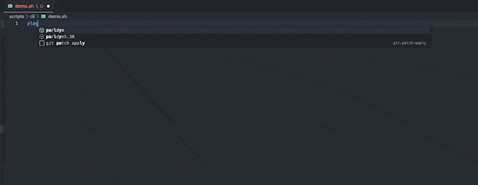

# 📜 Change Log

## February 2025
##### 🌟 Enhancements

- 👾 Add missing ActiveMQ fully managed connector example [#6247](https://github.com/vdesabou/kafka-docker-playground/issues/6247)

## February 2025
##### 🌟 Enhancements

- 👾 Add missing ActiveMQ fully managed connector example [#6247](https://github.com/vdesabou/kafka-docker-playground/issues/6247)

## February 2025
##### 🌟 Enhancements

- 👾 Add missing ActiveMQ fully managed connector example [#6247](https://github.com/vdesabou/kafka-docker-playground/issues/6247)

## January 2025
##### 🌟 Enhancements

- 💫 failover to other connect worker rest api when  --enable-multiple-connect-workers is used [#6229](https://github.com/vdesabou/kafka-docker-playground/issues/6229)
- 🧹Use REST API readiness for waiting connect to start [#6226](https://github.com/vdesabou/kafka-docker-playground/issues/6226)
- 🧹 Add log.sensitive.data to all Oracle CDC examples [#6206](https://github.com/vdesabou/kafka-docker-playground/issues/6206)
- 🐳 Allow to override all CP images [#6187](https://github.com/vdesabou/kafka-docker-playground/issues/6187)
- 🐳 Allow to override CP_CONNECT_IMAGE [#6082](https://github.com/vdesabou/kafka-docker-playground/issues/6082)
- 🧠 playground topic produce --tombstone improvements [#6078](https://github.com/vdesabou/kafka-docker-playground/issues/6078)
- 🧠 playground topic produce: make nb_max_messages_to_generate configurable [#5976](https://github.com/vdesabou/kafka-docker-playground/issues/5976)
- 👾 Add fully managed s3 example with Confluent Cloud Provider Integration [#5952](https://github.com/vdesabou/kafka-docker-playground/issues/5952)
- 🧠 Add CI results when using playground run command [#5527](https://github.com/vdesabou/kafka-docker-playground/issues/5527)
- 👾 Make self-managed AWS examples working with short-lived credentials [#4894](https://github.com/vdesabou/kafka-docker-playground/issues/4894)

##### 🐛 Bugs

- 🐛 connector example not downloading plugin when open the file in editor is selected in menu [#6234](https://github.com/vdesabou/kafka-docker-playground/issues/6234)
- 🐛 Conduktor is broken [#6218](https://github.com/vdesabou/kafka-docker-playground/issues/6218)
- 🧠 flink_connectors variable warnings during playground stop [#6205](https://github.com/vdesabou/kafka-docker-playground/issues/6205)
- 🧠 issue when playground CLI is not in PATH [#6204](https://github.com/vdesabou/kafka-docker-playground/issues/6204)
- 🧠 playground connector create-or-update: --initial-state breaking connection.url and query [#6005](https://github.com/vdesabou/kafka-docker-playground/issues/6005)

## December 2024

- CLI:
  * Add schema metadata support to `playground schema register` [#6006](https://github.com/vdesabou/kafka-docker-playground/issues/6006)
  * `playground topic produce` `--tombstone` improvements [#6078](https://github.com/vdesabou/kafka-docker-playground/issues/6078)
 
## October 2024

- Add custom connector example for Tabular Iceberg sink [#5971](https://github.com/vdesabou/kafka-docker-playground/issues/5971)

## September 2024

- Add Fully Managed Google Cloud Functions Gen 2 Sink Connector[#5869](https://github.com/vdesabou/kafka-docker-playground/issues/5869)
- Add example for [kafka-connect-jsonata](https://github.com/rayokota/kafka-connect-jsonata) [#5756](https://github.com/vdesabou/kafka-docker-playground/issues/5756)
- Added Fully Managed HTTP Sink V2 Fully Managed example [#5885](https://github.com/vdesabou/kafka-docker-playground/issues/5885)
- Added Fully Managed HTTP Source V2 Fully Managed example [#5885](https://github.com/vdesabou/kafka-docker-playground/issues/5885)
- Added Fully Managed Datagen Source example [#5876](https://github.com/vdesabou/kafka-docker-playground/issues/5876)
- Add example for [jsonata](https://yokota.blog/2024/07/15/jsonata-the-missing-declarative-language-for-kafka-connect/) [#5756](https://github.com/vdesabou/kafka-docker-playground/issues/5756)
- Update playground to be compatible with CLI v4 [#5829](https://github.com/vdesabou/kafka-docker-playground/issues/5829)
- CLI:
  * Add --initial-state option to "playground connector create-or-update" [#5929](https://github.com/vdesabou/kafka-docker-playground/issues/5929)
  * Add option to skip "The current repo version is older than ..." [#5874](https://github.com/vdesabou/kafka-docker-playground/issues/5874) 
  * Provide option to skip killing all the containers for playground run [#5927](https://github.com/vdesabou/kafka-docker-playground/issues/5927)
  * add `--histo` and `--live` option to playground debug heap-dump [#5814](https://github.com/vdesabou/kafka-docker-playground/issues/5814)

## July 2024

- Added Fully Managed Amazon DynamoDB CDC Source Connector [#5749](https://github.com/vdesabou/kafka-docker-playground/issues/5749)
- Added [Debezium CDC source connector metrics](https://debezium.io/documentation/reference/stable/connectors/mysql.html#mysql-monitoring) to JMX Grafana dashboard [#5721](https://github.com/vdesabou/kafka-docker-playground/issues/5721)
- CLI:
  * 🔥 Added `playground ec2` [command](/playground%20ec2) [#5730](https://github.com/vdesabou/kafka-docker-playground/issues/5730) to create and manage AWS EC2 instances (using Cloud Formation) to run
  kafka-docker-playground. 🪄 Open EC2 instances directly in Visual Studio code using Remote Development (over SSH). This is replacing Alfred workflow which was available earlier.

## June 2024

- CLI:
  * Added `playground container set-environment-variables` command [#5712](https://github.com/vdesabou/kafka-docker-playground/issues/5712)
  * Added `playground cleanup-cloud-details` [#5692](https://github.com/vdesabou/kafka-docker-playground/issues/5692)
  * Added `playground connector offsets get-offsets-request-status` [#5691](https://github.com/vdesabou/kafka-docker-playground/issues/5691)
  * 🔥 Added support for [Create connectors with offsets](https://docs.confluent.io/cloud/current/connectors/offsets.html#create-connectors-with-offsets) for fully managed connectors with `--offsets` option [#5689](https://github.com/vdesabou/kafka-docker-playground/issues/5689) in `playground connector create-or-update`
  * Added `max-wait` option to `playground connector show-lag`
  * Added [playground tools read-parquet-file](/playground%20tools%20read-parquet-file) command [#5682](https://github.com/vdesabou/kafka-docker-playground/issues/5682)
  * Added [playground tools read-avro-file](/playground%20tools%20read-avro-file) command [#5681](https://github.com/vdesabou/kafka-docker-playground/issues/5681)
- Add [Mongo source and sink JMX metrics](https://www.mongodb.com/docs/kafka-connector/current/monitoring/#sink-connector-jmx-metrics) to JMX Grafana dashboard [#5720](https://github.com/vdesabou/kafka-docker-playground/issues/5720)
* Add onprem HTTP source connector example [#5727](https://github.com/vdesabou/kafka-docker-playground/issues/5727)
* Add Fully Managed HTTP sink example with MTLS Auth [#5668](https://github.com/vdesabou/kafka-docker-playground/issues/5668)
* Removed cp-ansible-playground examples [#5694](https://github.com/vdesabou/kafka-docker-playground/issues/5694)

## May 2024

- CLI:
  * Add playground debug java-debug [#5663](https://github.com/vdesabou/kafka-docker-playground/issues/5663)
  * 🔥 Added [playground tcp-proxy](/playground%20tcp-proxy) CLI command to simulate TCP connection issues (reset,delay,throttle,corrupt) using emicklei/zazkia (https://github.com/emicklei/zazkia) TCP proxy
  * Add [playground container change-jdk](/playground%20container%20change-jdk) CLI command [#5584](https://github.com/vdesabou/kafka-docker-playground/issues/)
  * Created video: Overview of [playground topic produce](/playground%20topic%20produce) CLI command:

<iframe width="560" height="315" src="https://www.youtube.com/embed/mbzHCewG_XE?si=J-bWKaH7ZoL6oPgt" title="YouTube video player" frameborder="0" allow="accelerometer; autoplay; clipboard-write; encrypted-media; gyroscope; picture-in-picture; web-share" referrerpolicy="strict-origin-when-cross-origin" allowfullscreen></iframe>

  * Added `--delete-topic` flag to `playground topic produce` (❌ Delete topic and associated schema/subject if applicable before producing data.)
  * Added `--consume` flag to `playground topic produce` (📥 After producing, directly consume topic)
  * Added lcc id in `playground connector status` when fully managed connector is used
- Add source and sink rabbitmq FM examples with SSL [#5664](https://github.com/vdesabou/kafka-docker-playground/issues/5664)
- Add sink rabbitmq example with SSL [#5666](https://github.com/vdesabou/kafka-docker-playground/issues/5666)
- Enable multiple connect workers to work with every environment (not only plaintext) [#5612](https://github.com/vdesabou/kafka-docker-playground/issues/5612)
- Enable multiple brokers to work with every environment (not only plaintext) [#5613](https://github.com/vdesabou/kafka-docker-playground/issues/5613)

## April 2024

- CLI:
  * 🔥 Added support for [Manage Offsets for Fully-Managed Connectors](https://docs.confluent.io/cloud/current/connectors/offsets.html) in [playground connector offsets](https://kafka-docker-playground.io/#/playground%20connector%20offsets) commands
  * Added `playground connector open-in-confluent-cloud` (🤖 Open Fully Managed connector in Confluent Cloud dashboard)
  * Added `playground connector logs` command. This is basically a shortcut for `playground container logs --container connect`. It does not work for Fully Managed connectors, except if you're a Confluent employee, this will open log in our internal tools (make sure to follow this first https://github.com/confluentinc/kafka-docker-playground-internal#how-to-use)
- Added  [Apache Iceberg Sink](https://github.com/vdesabou/kafka-docker-playground/tree/master/connect/connect-iceberg-sink)
- Added Fully Managed connectors (also in CI):
  -  [Amazon Redshift Sink](https://github.com/vdesabou/kafka-docker-playground/tree/master/ccloud/fm-aws-redshift-sink)
  -  [Azure Functions Sink](https://github.com/vdesabou/kafka-docker-playground/tree/master/ccloud/fm-azure-functions-sink)
  -  [Google BigQuery (Legacy) Sink](https://github.com/vdesabou/kafka-docker-playground/tree/master/ccloud/fm-gcp-bigquery-legacy-sink)
  -  [Google BigQuery V2 Sink](https://github.com/vdesabou/kafka-docker-playground/tree/master/ccloud/fm-gcp-bigquery-v2-sink)
  -  [Azure Blob Storage Sink](https://github.com/vdesabou/kafka-docker-playground/tree/master/ccloud/fm-azure-blob-storage-sink)
  -  [Google Cloud Functions Sink](https://github.com/vdesabou/kafka-docker-playground/tree/master/ccloud/fm-gcp-cloud-functions-sink)
  -  [Amazon CloudWatch Logs Source](https://github.com/vdesabou/kafka-docker-playground/tree/master/ccloud/fm-aws-cloudwatch-logs-source)
  -  [Amazon CloudWatch Metrics Sink](https://github.com/vdesabou/kafka-docker-playground/tree/master/ccloud/fm-aws-cloudwatch-metrics-sink)
  -  [Azure Cosmos DB Sink](https://github.com/vdesabou/kafka-docker-playground/tree/master/ccloud/fm-azure-cosmosdb-sink)
  -  [Azure Cosmos DB Source](https://github.com/vdesabou/kafka-docker-playground/tree/master/ccloud/fm-azure-cosmosdb-source)
  -  [Azure Data Lake Storage Gen2 Sink](https://github.com/vdesabou/kafka-docker-playground/tree/master/ccloud/fm-azure-data-lake-storage-gen2-sink)
  -  [Amazon DynamoDB Sink](https://github.com/vdesabou/kafka-docker-playground/tree/master/ccloud/fm-aws-dynamodb-sink)
  -  [Google Cloud BigTable Sink](https://github.com/vdesabou/kafka-docker-playground/tree/master/ccloud/fm-gcp-bigtable-sink)
  -  [Google Cloud Pub/Sub Source](https://github.com/vdesabou/kafka-docker-playground/tree/master/ccloud/fm-gcp-pubsub-source)
  -  [Google Cloud Storage Sink](https://github.com/vdesabou/kafka-docker-playground/tree/master/ccloud/fm-gcp-gcs-sink)
  -  [Google Cloud Storage Source](https://github.com/vdesabou/kafka-docker-playground/tree/master/ccloud/fm-gcp-gcs-source)
  -  [HTTP Source](https://github.com/vdesabou/kafka-docker-playground/tree/master/ccloud/fm-http-source)
  -  [InfluxDB 2 Sink](https://github.com/vdesabou/kafka-docker-playground/tree/master/ccloud/fm-influxdb2-sink)
  -  [InfluxDB 2 Source](https://github.com/vdesabou/kafka-docker-playground/tree/master/ccloud/fm-influxdb2-source)
  -  [Amazon Kinesis Source](https://github.com/vdesabou/kafka-docker-playground/tree/master/ccloud/fm-aws-kinesis-source)
  -  [AWS Lambda Sink](https://github.com/vdesabou/kafka-docker-playground/tree/master/ccloud/fm-aws-lambda-sink)
  -  [MQTT Source](https://github.com/vdesabou/kafka-docker-playground/tree/master/ccloud/fm-mqtt-source)
  -  [Debezium CDC MySQL Legacy Source](https://github.com/vdesabou/kafka-docker-playground/tree/master/ccloud/fm-debezium-mysql-legacy-source)
  -  [Debezium CDC MySQL V2 Source](https://github.com/vdesabou/kafka-docker-playground/tree/master/ccloud/fm-debezium-mysql-v2-source)
  -  [JDBC MySQL Source](https://github.com/vdesabou/kafka-docker-playground/tree/master/ccloud/fm-jdbc-mysql-source)
  -  [JDBC MySQL Source](https://github.com/vdesabou/kafka-docker-playground/tree/master/ccloud/fm-jdbc-mysql-source)
  -  [JDBC Oracle 19c Source](https://github.com/vdesabou/kafka-docker-playground/tree/master/ccloud/fm-jdbc-oracle19-source)
  -  [Debezium CDC PostgreSQL Legacy Source](https://github.com/vdesabou/kafka-docker-playground/tree/master/ccloud/fm-debezium-postgresql-legacy-source)
  -  [Debezium CDC PostgreSQL V2 Source](https://github.com/vdesabou/kafka-docker-playground/tree/master/ccloud/fm-debezium-postgresql-v2-source)
  -  [JDBC PostGreSQL Sink](https://github.com/vdesabou/kafka-docker-playground/tree/master/ccloud/fm-jdbc-postgresql-sink)
  -  [SalesForce PushTopics Source](https://github.com/vdesabou/kafka-docker-playground/tree/master/ccloud/fm-salesforce-pushtopics-source)
  -  [SalesForce SObject Sink](https://github.com/vdesabou/kafka-docker-playground/tree/master/ccloud/fm-salesforce-sobject-sink)
  -  [Azure Cognitive Search Sink](https://github.com/vdesabou/kafka-docker-playground/tree/master/ccloud/fm-azure-cognitive-search-sink)
  -  [Azure Service Bus Source](https://github.com/vdesabou/kafka-docker-playground/tree/master/ccloud/fm-azure-service-bus-source)
  -  [Azure Synapse Analytics Sink](https://github.com/vdesabou/kafka-docker-playground/tree/master/ccloud/fm-azure-synapse-analytics-sink)
  -  [Debezium CDC Microsoft SQL Server Legacy Source](https://github.com/vdesabou/kafka-docker-playground/tree/master/ccloud/fm-debezium-sqlserver-legacy-source)
  -  [Debezium CDC Microsoft SQL Server V2 Source](https://github.com/vdesabou/kafka-docker-playground/tree/master/ccloud/fm-debezium-sqlserver-v2-source)
  -  [Amazon SQS Source](https://github.com/vdesabou/kafka-docker-playground/tree/master/ccloud/fm-aws-sqs-source)
  *  [Azure Blob Storage Source](https://github.com/vdesabou/kafka-docker-playground/tree/master/ccloud/fm-azure-blob-storage-source)
  *  [Google Cloud Spanner Sink](https://github.com/vdesabou/kafka-docker-playground/tree/master/ccloud/fm-gcp-spanner-sink)
  -  [Datadog Metrics Sink](https://github.com/vdesabou/kafka-docker-playground/tree/master/ccloud/fully-managed-datadog-metrics-sink)
  -  [Github Source](https://github.com/vdesabou/kafka-docker-playground/tree/master/ccloud/fm-github-source)
  -  [JIRA Source](https://github.com/vdesabou/kafka-docker-playground/tree/master/ccloud/fm-jira-source)
  -  [JDBC Microsoft SQL Server Sink](https://github.com/vdesabou/kafka-docker-playground/tree/master/ccloud/fm-jdbc-sqlserver-sink)
  -  [MongoDB Atlas Source](https://github.com/vdesabou/kafka-docker-playground/tree/master/ccloud/fm-mongodb-source)
  -  [MongoDB Atlas Sink](https://github.com/vdesabou/kafka-docker-playground/tree/master/ccloud/fm-mongodb-sink)
  -  [JDBC Microsoft SQL Server Source](https://github.com/vdesabou/kafka-docker-playground/tree/master/ccloud/fm-jdbc-sqlserver-source)
  -  [Zendesk Source](https://github.com/vdesabou/kafka-docker-playground/tree/master/ccloud/fm-zendesk-source)
  -  [SalesForce Bulk API Source](https://github.com/vdesabou/kafka-docker-playground/tree/master/ccloud/fm-salesforce-bulkapi-source)
  -  [SalesForce Bulk API 2.0 Source](https://github.com/vdesabou/kafka-docker-playground/tree/master/ccloud/fm-salesforce-bulkapi-2-0-source)
  -  [SalesForce Bulk API 2.0 Sink](https://github.com/vdesabou/kafka-docker-playground/tree/master/ccloud/fm-salesforce-bulkapi-2-0-sink)
  -  [Salesforce Platform Event Source](https://github.com/vdesabou/kafka-docker-playground/tree/master/ccloud/fm-salesforce-platform-events-source)
  -  [ServiceNow Source](https://github.com/vdesabou/kafka-docker-playground/tree/master/ccloud/fm-servicenow-source)
  -  [ServiceNow Sink](https://github.com/vdesabou/kafka-docker-playground/tree/master/ccloud/fm-servicenow-sink)
  -  [Splunk Sink](https://github.com/vdesabou/kafka-docker-playground/tree/master/ccloud/fm-splunk-sink)
  -  [Solace Sink](https://github.com/vdesabou/kafka-docker-playground/tree/master/ccloud/fm-solace-sink)
  -  [OpenSearch Sink](https://github.com/vdesabou/kafka-docker-playground/tree/master/ccloud/fm-opensearch-sink)
  -  [SFTP Sink](https://github.com/vdesabou/kafka-docker-playground/tree/master/ccloud/fm-sftp-sink)
  -  [Redis Sink](https://github.com/vdesabou/kafka-docker-playground/tree/master/ccloud/fm-redis-sink)
  -   [RabbitMQ Sink](https://github.com/vdesabou/kafka-docker-playground/tree/master/ccloud/fm-rabbitmq-sink)
  -  [PagerDuty Sink](https://github.com/vdesabou/kafka-docker-playground/tree/master/ccloud/fm-pagerduty-sink)
  -  [JDBC MySQL Sink](https://github.com/vdesabou/kafka-docker-playground/tree/master/ccloud/fm-jdbc-mysql-sink)
  -  [JDBC PostGreSQL Source](https://github.com/vdesabou/kafka-docker-playground/tree/master/ccloud/fm-jdbc-postgresql-source)
  -  [JDBC Oracle 19c Sink](https://github.com/vdesabou/kafka-docker-playground/tree/master/ccloud/fm-jdbc-oracle19-sink)
  -  [Azure Log Analytics Sink](https://github.com/vdesabou/kafka-docker-playground/tree/master/ccloud/fm-azure-log-analytics-sink)

## March 2024

- CLI:
  * Added `--skip-automatic-connector-config` flag to `create-or-update-connector` to skip automatic configuration when `--environment` flag is used (only useful to reproduce issues)
  * Added generic flag `--output-level`
  * Added `--no-null` flag to `playground topic produce`, see example https://github.com/vdesabou/kafka-docker-playground/issues/5285#issue-2162976678
  * Added `--id` flag to `playground get schema` command
  * `playground connector log-level` also set `org.apache.kafka.connect.runtime.WorkerSinkTask` for sink and `org.apache.kafka.connect.runtime.WorkerSourceTask` for source connectors
* Added Fully Managed [Oracle Database Source (JDBC)](https://github.com/vdesabou/kafka-docker-playground/blob/master/ccloud/fm-jdbc-oracle19-source/fully-managed-jdbc-oracle19-source.sh), also with SSL.
* Added [JMS source with Active MQ](https://github.com/vdesabou/kafka-docker-playground/tree/master/connect/connect-jms-active-mq-source)
* Added [Schema references](https://github.com/vdesabou/kafka-docker-playground/tree/master/other/schema-references)
  
## February 2024

- CLI:
  * 🔥 Added interactive mode with `playground update-version`
  * Added [playground connector offsets](/playground%20connector%20offsets) commands `get`, `reset` and `alter` for source and sink connectors including First-class offsets (KIP-875)!
  * Added `playground cleanup-cloud-resources` 🧹 Cleanup cloud resources that were created by running examples from the playground
  * 🔥 Added interactive mode with `playground re-run` and `playground repro bootstrap`
  * 🔥 Added interactive mode when `playground run` is executed without providing `--file`
  * removed `playground start-environment` in favor of interactive `playground run`
  * adding `--id` to `playground schema delete` and `playground schema register`
  * `--tag`, `cluster-name` and `cluster-environment` have now completion with fzf
  * `playground run-ccloud` has been removed, use `playground run` instead
  * `playground connector show-lag`: removed `--wait-for-zero-lag` flag, it will always wait for lag to becomes 0
  * `playground repro boostrap`: --file is now optional (if not set, currently running example is used)
  * Added `--vvv` (or `-v`) generic flag to activate verbose mode (example `playground --vvv status`))
  * Removed `playground fully-managed-connector` (handle transparently by `playground connector`)
  * Improved `playground connector show-lag`
  * Deprecated playground repro bootstrap `--producer` flag in favor of `playground topic produce`: flags are now hidden. Instructions are [here](/legacy-java-producer) if you still want to use it

* Added [JDBC source with Azure Synapse Analytics](https://github.com/vdesabou/kafka-docker-playground/tree/master/connect/connect-jdbc-azure-synapse-analytics-source)
* Added [Fully Managed GCP BigQuery Sink V2](https://github.com/vdesabou/kafka-docker-playground/tree/master/ccloud/fm-gcp-bigquery-v2-sink)
* Added [Fully Managed JDBC MySQL Source connector](https://github.com/vdesabou/kafka-docker-playground/tree/master/ccloud/fm-jdbc-mysql-source)

## January 2024

- CLI:
  * 🔥 if `--connector-tag` is set to `" "`, it will allow you to select version dynamically ! See [example](https://asciinema.org/a/633205)
  * Added [playground connector-plugin versions](/playground%20connector-plugin%20versions) command
  * Added [playground remove-all-docker-images](/playground%20remove-all-docker-images) command
  * 🔥 Add [playground connector select-config](/playground%20connector%20select-config) to easily select config from all possible configuration parameters of connector ! Tip: use <tab> to select multiple config at once ! See [example](https://asciinema.org/a/633314)
  * Added `--only-show-json` to `connector show-config-parameters` command in order to list of all available parameters for connector (with default value when applicable)
  * Added `playground connector open-docs` command
  * Connector config is copied to the clipboard (MacOS only) when calling `playground connector create-or-update` and `playground connector status`

* Added [See TLS traffic with mitmproxy](/reusables?id=%f0%9f%95%b5%ef%b8%8f%e2%99%82%ef%b8%8f-see-tls-traffic-with-mitmproxy)
* Added [Custom Connector with S3 sink](https://github.com/vdesabou/kafka-docker-playground/tree/master/ccloud/custom-connector-connect-aws-s3-sink)
* Added [HBase sink example with kerberos](https://github.com/vdesabou/kafka-docker-playground/blob/master/connect/connect-hbase-sink/hbase-sink-kerberos.sh)

## December 2023

- CLI:
  * 💫 Any connector example can be run as *self-managed* by using `--environment ccloud` option when running it with [playground run](/playground%20run) command ! This is also the case for any other [environment](/content?id=%f0%9f%94%90-environments)
  * Added [playground switch-ccloud](/playground%20switch-ccloud) to quickly switch to ccloud environment and [playground switch-back](/playground%20switch-back) to switch back to original environment
  * [playground topic delete](/playground%20topic%20delete) now also delete associated schema/subject (use `skip-delete-schema` to disable)
  * Added `--all` flag to [playground connector plugins](/playground%20connector%20plugins)
  * Added [playground history](/playground%20history) command
  * Added `--validate` to `playground connector create-or-update`

## November 2023

- CLI:
  * Added [playground connector-plugin search-jar](/playground%20connector-plugin%20search-jar) command
  * Added `--enable-rest-proxy` flag to run, re-run, start-environment and repro bootstrap commands
  * Added [playground connector stop](/playground%20connector%20stop) command 
  * `--nb-messages` for [playground topic produce](/playground%20topic%20produce): if you set it to -1, an infinite number of records will be sent by batches of 300000 records
  * `--key` for [playground topic produce](/playground%20topic%20produce) can now use same input parameters as `--value`
  * Added [playground start-environment](/playground%20start-environment) command
  * `--pipeline` flag for `playground repro bootstrap` command is now repeatable, meaning you can create a pipeline from one source connector to multiple sink connectors !

## October 2023

* Added JDBC MariaDB [Source](https://github.com/vdesabou/kafka-docker-playground/tree/master/connect/connect-jdbc-mariadb-source) and [Sink](https://github.com/vdesabou/kafka-docker-playground/tree/master/connect/connect-jdbc-mariadb-sink) examples (🙏 @pulkitnt)
* HTTP sink examples ([no-auth](https://github.com/vdesabou/kafka-docker-playground/blob/master/connect/connect-http-sink/http_no_auth.sh) and [Oauth2](https://github.com/vdesabou/kafka-docker-playground/blob/master/connect/connect-http-sink/http_oauth2_auth.sh)) have endpoints to set response error code, add delay and set response body
* Added [Shell Script Command Completion Visual Studio Code extension](/cli?id=%f0%9f%aa%84-setup-shell-script-command-completion-visual-studio-code-extension)

* Added [🎏 KSQL examples](/content?id=%f0%9f%8e%8f-ksql) (🙏 @jocelyndrean and @SamiShaikh)
* Improved JMX Grafana [dashboard](/how-to-use?id=grafana-dashboards):
  * List of provided dashboards:
     - Confluent Platform overview 🆕
     - Zookeeper cluster 🆕
     - Kafka cluster
     - Kafka topics 🆕
     - Kafka quotas 🆕
     - Schema Registry cluster 🆕
     - Kafka Connect cluster
     - ksqlDB cluster 🆕
     - Kafka Clients 🆕
     - Kafka lag exporter
     - Cluster Linking 🆕
     - Kafka streams RocksDB 🆕
     - Oracle CDC source Connector 🆕
- CLI:
  * Added `--subject` flag to `playground topic consume` command (useful when data was produced with --value-subject-name-strategy other than TopicNameStrategy)
  * Added `playground topic list` command
  * Displaying schema with `playground topic consume` command
  * Added `--max-characters` flag to `playground topic consume` command
  * 🔥 Added [playground update-version](/playground%20update-version): you can now change cp version and/or connector(s) version(s) while running an example
  * Added [playground status](/playground%20status) command

## September 2023

* Added [Debezium CDC example with Oracle 19c](https://github.com/vdesabou/kafka-docker-playground/tree/master/connect/connect-debezium-oracle19-source)
* Added [How to write connect logs to a kafka topic](https://github.com/vdesabou/kafka-docker-playground/tree/master/other/write-logs-to-topic)
* Added [MQTT Proxy example](https://github.com/vdesabou/kafka-docker-playground/tree/master/other/mqtt-proxy) with SASL_PLAINTEXT
- CLI:
  * Added `repro export` and `repro import`
  * Added `--validate` flag to `playground topic produce` command
  * Added `--producer-property` (can be set multiple times) to `playground topic produce` command
  * Added `--record-size` to `playground topic produce` command
  * Added `alter topic` command
  * Added `debug generate-diagnostics` command

## August 2023

* Added [MQTT Proxy example](https://github.com/vdesabou/kafka-docker-playground/tree/master/other/mqtt-proxy)
* Oracle 19 examples are now supported on M1 chip (ARM64) Mac
- CLI:
  * Added `connector show-config` 
  * Renamed `playground bootstrap-reproduction-model` to `playground repro bootstrap`

## July 2023

- Added ssl examples for mongo source and sink
- Added [JDBC Google BigQuery Source](https://github.com/vdesabou/kafka-docker-playground/tree/master/connect/connect-jdbc-gcp-bigquery-source)
- CLI:
  * Added `--compatibility` to `topic produce` [command](/cli?id=%f0%9f%93%a5-produce)
  * Only show fzf preview when terminal is wide enough
  * Added `debug flight-recorder`
  * Added `connector show-config-parameters` command
  * Added `open-docs` command
  * Added `debug block-traffic`
  * Added `debug testssl`
  * Added `--generate-only` and `--force-value` to `topic produce` [command](/cli?id=%f0%9f%93%a5-produce)
  * Added `--headers` to `topic produce` [command](/cli?id=%f0%9f%93%a5-produce)

## June 2023

- Added [Lenses JMS source for ActiveMQ](https://github.com/vdesabou/kafka-docker-playground/tree/master/connect/connect-lenses-active-mq-source)
- Add [Oracle CDC JMX metrics](https://docs.confluent.io/kafka-connectors/oracle-cdc/current/oracle-metrics.html) to JMX Grafana dashboard
- CLI: 
  * Added `debug thread-dump`
  * Added `--tail` option to `topic consume`
  * 🔥 Added `topic produce` [command](/cli?id=%f0%9f%93%a5-produce)
  * Added `topic create` and `topic delete` commands
  * Added `--verbose` flag for produce and consume
- Added [SSL example](https://github.com/vdesabou/kafka-docker-playground/blob/master/connect/connect-rabbitmq-source/rabbitmq-source-ssl.sh) for RabbitMQ source

## May 2023

- Use `playground topic consume` in all examples (bash version 4 or higher is now required to use playground)
- ACADEMY:
  * Avro Converter: Unknown magic byte
  * InsertField SMT: DataException: Only Struct objects supported (sink connector)
  * InsertField SMT: DataException: Only Struct objects supported (source connector)
  * InsertField SMT: adding topic, offset and partition not working
- CLI: 
  * Add latest version from hub in `playground connector versions` command 
  * Added `--expected-messages` to `topic consume`
  * `repro bootstrap`: `--producer-schema-key` and `--producer-schema-value` will now open text editor: Copy and paste the schema you want to use for the key/value, save and close the file to continue, it will automatically make required changes
  * `--topic` is now optional for all [Topics commands](/cli?id=%f0%9f%97%b3-topics-commands) ! By default it will loop on all non-internal topics
- [🧠 CLI](/cli) is now version 1.0.0
- Added 🔍 [ksqlDB Schema Inference with ID](https://github.com/vdesabou/kafka-docker-playground/tree/master/ksqldb/schema-inference-with-id) (🙏 @danielpetisme)

## April 2023

- Added 🖇️ [Monitoring cluster linking](https://github.com/vdesabou/kafka-docker-playground/tree/master/other/monitoring-cluster-linking) (🙏 @danielpetisme)
- Added 🤿 [Anonymous SR-example with RBAC](https://github.com/vdesabou/kafka-docker-playground/tree/master/other/rbac-with-anonymous-sr) (🙏 @Schm1tz1)
- Added 🧢 [RBAC with SR Basic Auth and ACLs](https://github.com/vdesabou/kafka-docker-playground/tree/master/other/rbac-with-sr-basic-auth-acl) (🙏 @Schm1tz1)
- Added `--producer-schema-key` and `--producer-schema-value` to `playground repro bootstrap`
- Added 🌪️ SQL Datagen tool for [PostgreSQL](/reusables?id=%f0%9f%91%89-postgresql) examples
- Added 🌪️ SQL Datagen tool for [MySql](/reusables?id=%f0%9f%91%89-mysql) examples
- Added 🌪️ SQL Datagen tool for [Microsoft Sql Server](/reusables?id=%f0%9f%91%89-microsoft-sql-server) examples
- Added 📛 [Pyroscope](https://pyroscope.io/docs/) to JMX Grafana
- Added CLI command `playground get-all-schemas` to get all schemas versions for all subjects.
- Added CLI command `playground topic consume` to consume topic without even needing to specify any config.
- Added CLI command `re-run` to re-run last example
- Added [Recovery from schema hard deletion](https://github.com/vdesabou/kafka-docker-playground/tree/master/other/recover-from-schema-hard-deletion) (🙏 @danielpetisme)
- Added AWS Lambda sink [with custom STS credentials provider](https://github.com/vdesabou/kafka-docker-playground/blob/master/connect/connect-aws-lambda-sink/lambda-sink-assuming-iam-role-with-custom-aws-credential-provider.sh)
- Added [Fully Managed SFTP source](https://github.com/vdesabou/kafka-docker-playground/tree/master/ccloud/fm-sftp-source) example
- Added [JDBC Amazon Redshift Sink](https://github.com/vdesabou/kafka-docker-playground/tree/master/connect/connect-jdbc-aws-redshift-sink) example
- Added [🏎️ Start an example with CLI](/#/how-to-use?id=%f0%9f%a7%a0-with-cli) using `playground run` command
- Added [👉 MQTT](/#/reusables?id=%f0%9f%91%89-mqtt) performances injection tool
- Added [🌍 Debug HTTP sink](/#/reusables?id=%f0%9f%8c%8d-debug-http-sink)

## March 2023

- No more using `vdesabou/kafka-docker-playground-connect` image [#3564](https://github.com/vdesabou/kafka-docker-playground/issues/3564)
- Added Google Cloud Pub/Sub Group Kafka Connector [Source](https://github.com/vdesabou/kafka-docker-playground/tree/master/connect/connect-gcp-google-pubsub-source) and [Sink](https://github.com/vdesabou/kafka-docker-playground/tree/master/connect/connect-gcp-google-pubsub-sink) connectors examples
- Added `--pipeline` flag option to `playground repro bootstrap` command: [🧑‍ How to build a pipeline](/reusables?id=%f0%9f%94%9b-how-to-build-a-pipeline) is now fully automated !
- Added `--custom-smt` flag option to `playground repro bootstrap` command.
- Added [🔂 Standalone connector examples](/content)
- Added [🧑‍💻 M1 chip (ARM64) Mac Support](/how-to-use?id=%f0%9f%a7%91%f0%9f%92%bb-m1-chip-arm64-mac-support) section
- Added [🧑‍🎓 Academy](/academy) section

## February 2023

- Added [🧠 CLI](/cli)
- Changed [🔐 Proxy with BASIC authentication](/reusables?id=%f0%9f%94%90-proxy-with-basic-authentication) to use [ubuntu/squid](https://hub.docker.com/r/ubuntu/squid) as nginx example was broken

## January 2023

- Added [🏎️ Performance testing](/reusables?id=%f0%9f%8f%8e%ef%b8%8f-performance-testing)
- Added [🕸️ Debug ServiceNow or Salesforce](/reusables?id=%f0%9f%95%b8%ef%b8%8f-debug-servicenow-or-salesforce)
- Added [↔️ Default Connect converter used](/how-it-works?id=%e2%86%94%ef%b8%8f-default-connect-converter-used)
- Added [🧙 How to install other connectors](/reusables?id=%f0%9f%a7%99-how-to-install-other-connector)
- Added [🧑‍ How to build a pipeline](/reusables?id=%f0%9f%94%9b-how-to-build-a-pipeline)

## December 2022

- Improved [♨️ Java producers](/reusables?id=%e2%99%a8%ef%b8%8f-java-producers) section with more explanations on environment variables that can be used.
- Added [🎁 Tips & Tricks](/tips-and-tricks)

## November 2022

- Added [🛩️ Flight Recorder](/reusables?id=%f0%9f%9b%a9%ef%b8%8f-flight-recorder)
- Added [👻 Heap Dump](/reusables?id=%f0%9f%91%bb-heap-dump)
- Added [🎯 Thread Dump](/reusables?id=%f0%9f%8e%af-thread-dump)

## January 2022

- Added [🛠 Bootstrap reproduction model](/reusables?id=%F0%9F%9B%A0-bootstrap-reproduction-model)

## October 2021

- Initial release 🥳
