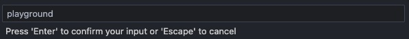

# 🧠 CLI

`playground` CLI is available in `scripts/cli/playground`.
It makes so much easier to use the playground and reduces a lot the Docker knowledge required !

## 🚜 Setup

### 🦶 Setup PATH

Add it to your `PATH` environment variable by adding this in your `~/.bashrc` or `~/.zshrc`:

```bash
export PATH=/path/to/kafka-docker-playground/scripts/cli:$PATH
```

> [!WARNING]
> The bash script generated by [bashly](https://bashly.dannyb.co/) can run in any shell, but require that bash 4 or higher is installed.
> Mac users can upgrade bash by running `brew install bash`

### ⚡ Setup completion

A Bash completion file is also available in `scripts/cli/completions.bash`.

In order to be able to use completion with the CLI, you just need to add this in your `~/.bashrc` or `~/.zshrc`:

```bash
source /path/to/kafka-docker-playground/scripts/cli/completions.bash
```

> [!NOTE]
> If you use ZSH, but **not** `Oh-My-Zsh`, please check [this](https://bashly.dannyb.co/advanced/bash-completion/#completions-in-zsh).

### 🪄 Setup Shell Script Command Completion Visual Studio Code extension

Get nice [IntelliSense](https://learn.microsoft.com/en-us/visualstudio/ide/using-intellisense?view=vs-2022) completion for `playground` CLI in Visual Studio Code ! It uses a slightly modified version of "Shell Script Command Completion" Visual Studio Code extension (https://marketplace.visualstudio.com/items?itemName=tetradresearch.vscode-h2o):


To install it, follow those 2 steps:

```bash
playground tools install-vscode-extension
```

Once installed, go on a `.sh` script and then type  in Palette `Ctrl+Shift+P` (or `⌘+⇧+P` on macOS) and choose `Shell Completion: Load Command Spec (experimental)` and then type `playground`




### ⚙️ Config

CLI can be configured using [playground config](/playground%20config) 

## ✨ Command Reference

**playground**

🧠 CLI for Kafka Docker Playground 🐳  
  
👉 Check documentation https://kafka-docker-playground.io/#/cli

| Attributes       | &nbsp;
|------------------|-------------
| Version:         | 1.0.0

### Usage

```bash
playground [OPTIONS] COMMAND
```

### Dependencies

*docker*

visit https://docs.docker.com/get-docker to install

### == Commands ==

- [help](playground%20help) - Show help about a command
- [status](playground%20status) - 🗺️ Show a status
- [config](playground%20config) - ⚙️ Configure CLI

### Run commands

- [run](playground%20run) - 🕹️ Run any example !
- [re-run](playground%20re-run) - ⚡ Simply re-run last example you ran with \<playground run\>
- [history](playground%20history) - 🏰 Get an history of the examples which were run with run command and run it again
- [switch-ccloud](playground%20switch-ccloud) - 🌩️  Switch to ccloud environment.
- [switch-back](playground%20switch-back) - 💺  Switch back from previous environment before switch-ccloud was called.
- [update-version](playground%20update-version) - ✨ Update current confluent platform or connector(s) with new version(s)
- [open](playground%20open) - 👐 When --file is not provided, simply open last example you ran with \<playground run\>
- [stop](playground%20stop) - 🛑 Stop currently running example
- [remove-all-docker-images](playground%20remove-all-docker-images) - 🧨 Remove all docker images (including docker volumes)
- [open-docs](playground%20open-docs) - 🧑‍🎓 Open Confluent documentation of currently running example
- [cleanup-cloud-resources](playground%20cleanup-cloud-resources) - 🧹 Cleanup cloud resources that were created by running examples from the playground

### Repro commands

- [repro](playground%20repro) - 👷‍♂️ Reproduction model commands
- [export](playground%20repro%20export) - 📤 Export as tgz file uncommitted reproduction models from the folder of current reproduction model
- [import](playground%20repro%20import) - 📥 Import tgz file which was created with export command
- [bootstrap](playground%20repro%20bootstrap) - 🛠  Bootstrap reproduction model, just run \<playground repro bootstrap\> !

### Kafka commands

- [get-docker-compose](playground%20get-docker-compose) - 🐋 Get docker-compose
- [get-jmx-metrics](playground%20get-jmx-metrics) - 🔢 Get JMX metrics from a container

### Schema commands

- [schema](playground%20schema) - 🔰 Schema commands
- [get](playground%20schema%20get) - 🔰 Get all schemas versions for specified subject (if --subject is not specified, all subjects will be used)
- [register](playground%20schema%20register) - ⏺️ Register a schema in specified subject
- [get-compatibility](playground%20schema%20get-compatibility) - 🛡️ Get subject-level compatibility
- [set-compatibility](playground%20schema%20set-compatibility) - 🛡️ Set subject-level compatibility
- [get-mode](playground%20schema%20get-mode) - 🔏 Get subject-level mode
- [set-mode](playground%20schema%20set-mode) - 🔏 Set subject-level mode
- [delete](playground%20schema%20delete) - 🧟 Delete schema

### TCP Proxy commands

- [tcp-proxy](playground%20tcp-proxy) - 🏚 Zazkia TCP Proxy commands
- [start](playground%20tcp-proxy%20start) - 💗 Start the TCP proxy and automatically replace connector config with zazkia hostname and port 49998
- [get-connections](playground%20tcp-proxy%20get-connections) - 🧲 Get Zazkia active TCP connections config and stats
- [delay](playground%20tcp-proxy%20delay) - ⏲️ Add milliseconds delay to service response.
- [break](playground%20tcp-proxy%20break) - 💔 Break sending the response to the client.
- [close-connection](playground%20tcp-proxy%20close-connection) - ❌ Close the Zazkia active TCP connections
- [close-all-connection-with-error](playground%20tcp-proxy%20close-all-connection-with-error) - 🧹 Close all Zazkia TCP connections which are in error state (close all with error button in Zazkia UI)
- [toggle-accept-connections](playground%20tcp-proxy%20toggle-accept-connections) - 🙅‍♂️ Change whether new connections can be accepted
- [toggle-reads-client](playground%20tcp-proxy%20toggle-reads-client) - ✅ Change whether reading data from the client is enabled.
- [toggle-reads-service](playground%20tcp-proxy%20toggle-reads-service) - ✅ Change whether reading data from the service is enabled.
- [toggle-writes-client](playground%20tcp-proxy%20toggle-writes-client) - ✅ Change whether writing data to the client is enabled.
- [toggle-writes-service](playground%20tcp-proxy%20toggle-writes-service) - ✅ Change whether reading data to the service is enabled.

### Tools commands

- [tools](playground%20tools) - 🧰 Tools commands
- [install-vscode-extension](playground%20tools%20install-vscode-extension) - 🪄 Install a slightly modified version of "Shell Script Command Completion" Visual Studio Code extension (https://marketplace.visualstudio.com/items?itemName=tetradresearch.vscode-h2o)
- [read-avro-file](playground%20tools%20read-avro-file) - 🔖 Read provided avro file
- [read-parquet-file](playground%20tools%20read-parquet-file) - 🔖 Read provided parquet file

### Debug commands

- [debug](playground%20debug) - 🐞 Debug commands
- [enable-remote-debugging](playground%20debug%20enable-remote-debugging) - ✨ Enable java remote debugging for container
- [testssl](playground%20debug%20testssl) - 🔐 Testing TLS/SSL encryption using https://testssl.sh/
- [generate-diagnostics](playground%20debug%20generate-diagnostics) - ⛑️ Generate a diagnostic bundle with Diagnostics Bundle Tool
- [thread-dump](playground%20debug%20thread-dump) - 🎯 Take a java thread dump
- [heap-dump](playground%20debug%20heap-dump) - 👻 Take a heap dump
- [tcp-dump](playground%20debug%20tcp-dump) - 🕵️‍♂️ Take a tcp dump (sniffing network)
- [block-traffic](playground%20debug%20block-traffic) - 🚫 Blocking traffic using iptables
- [java-debug](playground%20debug%20java-debug) - 🤎 JVM arguments for SSL, Kerberos or Class Loading
- [flight-recorder](playground%20debug%20flight-recorder) - 🛩️ Record flight recorder
- [log-level](playground%20debug%20log-level) - 🧬 Set log level for any package

### Container commands

- [container](playground%20container) - 🐳 Container commands
- [get-properties](playground%20container%20get-properties) - 📝 Get properties file from a container
- [recreate](playground%20container%20recreate) - 💫 Recreate container(s)
- [get-ip-addresses](playground%20container%20get-ip-addresses) - 🖥️  Get ip address of running containers
- [kill-all](playground%20container%20kill-all) - 💀 Kill all containers
- [logs](playground%20container%20logs) - 🕵️  Tail and follow container logs
- [ssh](playground%20container%20ssh) - 🛬 SSH into container
- [change-jdk](playground%20container%20change-jdk) - 🤎 Change java JDK version using Azul JDK (https://www.azul.com/downloads/#downloads-table-zulu)
- [exec](playground%20container%20exec) - 🪄  Execute command in a container
- [restart](playground%20container%20restart) - 🔁 Restart a container
- [pause](playground%20container%20pause) - ⏸️  Pause a container
- [resume](playground%20container%20resume) - ⏯️  Resume a container
- [kill](playground%20container%20kill) - 🔫 Kill a container

### Topic commands

- [topic](playground%20topic) - 🗳 Topic commands
- [get-number-records](playground%20topic%20get-number-records) - 💯 Get number of records in a topic
- [display-consumer-offsets](playground%20topic%20display-consumer-offsets) - 📭 Display content of __consumer_offsets topic
- [list](playground%20topic%20list) - 🔘 List topics
- [describe](playground%20topic%20describe) - 🔬 Describe topic
- [set-schema-compatibility](playground%20topic%20set-schema-compatibility) - 🛡️ Change topic's schema compatibility
- [consume](playground%20topic%20consume) - 📥 Consume topic from beginning
- [produce](playground%20topic%20produce) - 📤 Produce to a topic
- [create](playground%20topic%20create) - 🆕 Create topic
- [delete](playground%20topic%20delete) - ❌ Delete topic and associated schema/subject if applicable
- [alter](playground%20topic%20alter) - 🪛 Alter topic config

### Connector-Plugin commands

- [connector-plugin](playground%20connector-plugin) - 🔌 Connector-plugin commands
- [search-jar](playground%20connector-plugin%20search-jar) - ☕ List jars for a connector plugin from confluent hub https://www.confluent.io/hub/ Search for specific class and display method signatures
- [versions](playground%20connector-plugin%20versions) - 💯 List versions for a connector plugin from confluent hub https://www.confluent.io/hub/

### Connector commands

- [connector](playground%20connector) - 🔗 Connector commands
- [status](playground%20connector%20status) - 🧩 Show status of all connectors
- [offsets](playground%20connector%20offsets) - 💈 Handle source and sink connectors offsets
- [plugins](playground%20connector%20plugins) - 🎨 Show all connector plugins installed. You can also display transforms, converters and predicates using --all flag
- [pause](playground%20connector%20pause) - ⏸️  Pause connector
- [versions](playground%20connector%20versions) - 🧞 Get current and latest versions available on Confluent Hub for connector(s) used in example
- [restart](playground%20connector%20restart) - ♻️  Restart connector
- [stop](playground%20connector%20stop) - 🛑 Stop connector (only available if CP \> 7.5 )
- [resume](playground%20connector%20resume) - ⏯️  Resume connector
- [delete](playground%20connector%20delete) - 🗑️  Delete connector
- [show-lag](playground%20connector%20show-lag) - 🐢 Show lag of sink connector
- [show-config](playground%20connector%20show-config) - 🧰 Show current connector config that was applied
- [show-config-parameters](playground%20connector%20show-config-parameters) - 🔩 Show all possible configuration parameters of connector
- [select-config](playground%20connector%20select-config) - 🗜️ Easily select config from all possible configuration parameters of connector
- [snippets](playground%20connector%20snippets) - 🔌 useful snippets
- [open-docs](playground%20connector%20open-docs) - 🧑‍🎓 Open connector documentation of currently running conector(s)
- [log-level](playground%20connector%20log-level) - 🧬 Set connect log level
- [logs](playground%20connector%20logs) - 🕵️  Tail and follow connect logs
- [open-in-confluent-cloud](playground%20connector%20open-in-confluent-cloud) - 🤖 Open Fully Managed connector in Confluent Cloud dashboard
- [create-or-update](playground%20connector%20create-or-update) - 🧑‍🎨  Create or update connector
- [update](playground%20connector%20update) - 🛠️ Update connector configuration by opening current connector config in text editor set with playground config editor \<editor\> (default is code). Once file is saved, the new configuration is updated.

## Options

#### *--vvv, -v*

🐛 set verbose output (set -x)  
  
❗ it can print sensitive information ❗  


#### *--output-level, -o LEVEL*

❕Log level used by all commands  
  
Default is INFO (all INFO, WARN and ERROR will be printed in command output)

| Attributes      | &nbsp;
|-----------------|-------------
| Allowed Values: | INFO, WARN, ERROR


