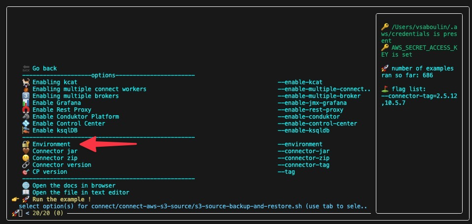
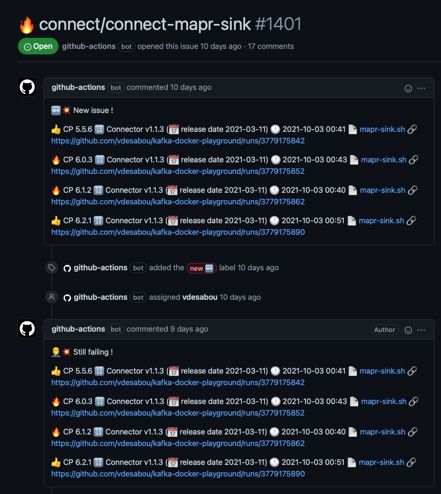
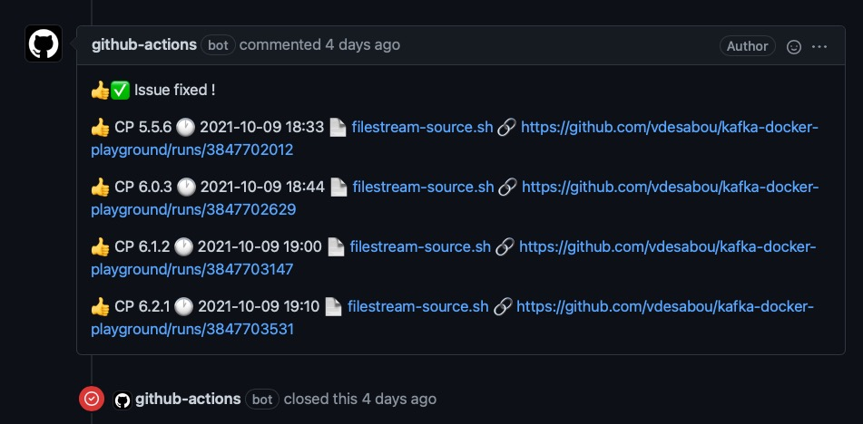
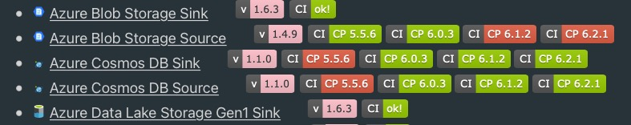

# 🎓️ How it works

Before learning how to create your own examples/reproduction models, here are some explanations on how the playground works internally...


## 🐳 Docker override

The playground makes extensive use of Docker Compose [override](https://docs.docker.com/compose/how-tos/multiple-compose-files/merge/) (i.e `docker compose -f docker-compose1.yml -f docker-compose2.yml ...`).

Each test is built based on an [environment](#/content?id=%F0%9F%94%90-environments), [PLAINTEXT](https://github.com/vdesabou/kafka-docker-playground/tree/master/environment/plaintext) being the most common one.

> [!TIP]
> Check **[📝 See properties file](/how-to-use?id=📝-see-properties-file)** section, in order to see the end result properties file.

Let's have a look at some examples to understand how it works:

### 🔓 Connector using PLAINTEXT

Example with ([active-mq-sink.sh](https://github.com/vdesabou/kafka-docker-playground/blob/master/connect/connect-active-mq-sink/active-mq-sink.sh)):

At the beginning of the script, we have:

```shell
$ PLAYGROUND_ENVIRONMENT=${PLAYGROUND_ENVIRONMENT:-"plaintext"}
$ playground start-environment --environment "${PLAYGROUND_ENVIRONMENT}" --docker-compose-override-file "${PWD}/docker-compose.plaintext.yml"
```

The *local* [`${PWD}/docker-compose.plaintext.yml`](https://github.com/vdesabou/kafka-docker-playground/blob/master/connect/connect-active-mq-sink/docker-compose.plaintext.yml) file is only composed of:

```yml
---
services:
  activemq:
    image: rmohr/activemq:5.15.9
    hostname: activemq
    container_name: activemq
    ports:
      - '61616:61616'
      - '8161:8161'

  connect:
    environment:
      CONNECT_PLUGIN_PATH: /usr/share/confluent-hub-components/confluentinc-kafka-connect-activemq-sink
```

It contains:

* `activemq` which is a container required for the test.
* `connect` container, which overrides value `CONNECT_PLUGIN_PATH` from [`environment/plaintext/docker-compose.yml`](https://github.com/vdesabou/kafka-docker-playground/blob/master/environment/plaintext/docker-compose.yml)

PLAINTEXT environment is used thanks to the call to `playground start-environment` (an internal command, called by the example when started with [playground run](/playground%20run)), which invokes the docker compose command in the end like this:

```bash
docker compose -f ../../environment/plaintext/docker-compose.yml -f ${PWD}/docker-compose.plaintext.yml up -d
```

> [!NOTE]
> With CP 8+ (Kraft mode), [`environment/plaintext/docker-compose-kraft.yml`](https://github.com/vdesabou/kafka-docker-playground/blob/master/environment/plaintext/docker-compose-kraft.yml) is also added, which brings the `controller` container.

### 🔐 Environment SASL/SSL 

Environments are also overriding [PLAINTEXT](https://github.com/vdesabou/kafka-docker-playground/tree/master/environment/plaintext), so for example [SASL/SSL](https://github.com/vdesabou/kafka-docker-playground/tree/master/environment/sasl-ssl) has a [docker-compose.yml](https://github.com/vdesabou/kafka-docker-playground/blob/master/environment/sasl-ssl/docker-compose.yml) file like this:

```yml
  ####
  #
  # This file overrides values from environment/plaintext/docker-compose.yml
  #
  ####

  <snip> (zookeeper section, only used with CP < 8)

  broker:
    volumes:
      - ../../environment/sasl-ssl/security:/etc/kafka/secrets
    environment:
      KAFKA_INTER_BROKER_LISTENER_NAME: SASL_SSL
      KAFKA_LISTENER_SECURITY_PROTOCOL_MAP: SASL_SSL:SASL_SSL
      KAFKA_ADVERTISED_LISTENERS: SASL_SSL://broker:9092
      KAFKA_LISTENERS: SASL_SSL://:9092
      CONFLUENT_METRICS_REPORTER_SECURITY_PROTOCOL: SASL_SSL
      CONFLUENT_METRICS_REPORTER_SASL_JAAS_CONFIG: "org.apache.kafka.common.security.plain.PlainLoginModule required \
        username=\"client\" \
        password=\"client-secret\";"
      CONFLUENT_METRICS_REPORTER_SASL_MECHANISM: PLAIN
      CONFLUENT_METRICS_REPORTER_SSL_TRUSTSTORE_LOCATION: /etc/kafka/secrets/kafka.client.truststore.jks
      CONFLUENT_METRICS_REPORTER_SSL_TRUSTSTORE_PASSWORD: confluent
      CONFLUENT_METRICS_REPORTER_SSL_KEYSTORE_LOCATION: /etc/kafka/secrets/kafka.client.keystore.jks
      CONFLUENT_METRICS_REPORTER_SSL_KEYSTORE_PASSWORD: confluent
      CONFLUENT_METRICS_REPORTER_SSL_KEY_PASSWORD: confluent
      KAFKA_SASL_ENABLED_MECHANISMS: PLAIN
      KAFKA_SASL_MECHANISM_INTER_BROKER_PROTOCOL: PLAIN
      KAFKA_SSL_KEYSTORE_FILENAME: kafka.broker.keystore.jks
      KAFKA_SSL_KEYSTORE_CREDENTIALS: broker_keystore_creds
      KAFKA_SSL_KEY_CREDENTIALS: broker_sslkey_creds
      KAFKA_SSL_TRUSTSTORE_FILENAME: kafka.broker.truststore.jks
      KAFKA_SSL_TRUSTSTORE_CREDENTIALS: broker_truststore_creds
      # enables 2-way authentication
      KAFKA_SSL_CLIENT_AUTH: "required"
      KAFKA_SSL_ENDPOINT_IDENTIFICATION_ALGORITHM: "HTTPS"
      KAFKA_OPTS: -Djava.security.auth.login.config=/etc/kafka/secrets/broker_jaas.conf
      KAFKA_SSL_PRINCIPAL_MAPPING_RULES: RULE:^CN=(.*?),OU=TEST.*$$/$$1/,DEFAULT

      <snip>
```

As you can see, it only contains what is required to add SASL/SSL to a PLAINTEXT environment 💫 !

### 🔏 Connector using non-plaintext environment

Any connector example can be run with any environment using `--environment` option of [playground run](/playground%20run?id=-environment-environment) command.



This also includes `cfk` environment which automatically runs the example with Kubernetes using [k3d](https://k3d.io/stable/) and Confluent for Kubernetes (CFK)

## 🔗 Connect image used

The Kafka Connect image is either [`cp-server-connect`](https://hub.docker.com/r/confluentinc/cp-server-connect) for version greater than `5.3.0` or [`cp-kafka-connect`](https://hub.docker.com/r/confluentinc/cp-kafka-connect) otherwise (it can be overridden with `CP_CONNECT_IMAGE` environment variable).

Several tools are [installed](https://github.com/vdesabou/kafka-docker-playground/blob/master/scripts/cli/src/lib/utils_function.sh) automatically on the image (see `CONNECT_3RDPARTY_INSTALL`) such as `openssl`, `tcpdump`, `iptables`, `netcat`, `jq`, etc..

If you're missing a tool, you can install it at runtime, some examples:

```bash
# recent (UBI minimal based) images, using microdnf
playground container exec -c connect --command "microdnf install -y tree" --root
# older images, using yum
playground container exec -c connect --command "yum install -y --disablerepo='Confluent*' tree" --root
```

## ↔️ Default Connect converter used

All connect examples use the converters defined in Connect Worker properties defined [here](https://github.com/vdesabou/kafka-docker-playground/blob/master/environment/plaintext/docker-compose.yml):

```yml
CONNECT_KEY_CONVERTER: "org.apache.kafka.connect.storage.StringConverter"
CONNECT_VALUE_CONVERTER: "io.confluent.connect.avro.AvroConverter"
CONNECT_VALUE_CONVERTER_SCHEMA_REGISTRY_URL: "http://schema-registry:8081"
```

Therefore:

* String converter for key
* Avro converter for value

This can, of course, be overridden at connector level.


## 🤖 How CI works

Every day (at 18:17 UTC), regression tests are executed using [Github Actions](https://github.com/features/actions). 

The workflow runs and logs are available [here](https://github.com/vdesabou/kafka-docker-playground/actions).

The CI, including the list of tests executed, is defined in [`.github/workflows/ci.yml`](https://github.com/vdesabou/kafka-docker-playground/blob/master/.github/workflows/ci.yml) file.

> [!NOTE]
> CI is executed on `ubuntu-latest` GitHub-hosted runners (`ubuntu-26.04` when running with Podman, which requires Podman 5.0+), see [documentation](https://docs.github.com/en/actions/using-github-hosted-runners/about-github-hosted-runners#supported-runners-and-hardware-resources)

> [!NOTE]
> A test is executed if:
> 
> * It was failing in the last run
> * A change has been made in the test directory
> * CP and/or connector version(s) has/have changed
> * Last execution was more than 14 days ago

If a test is failing 🔥, a Github issue will be automatically opened or updated with results for each CP version.

*Example:*

Issue [#1401](https://github.com/vdesabou/kafka-docker-playground/issues/1401):



The Github issue will be automatically closed when all results for a test are ok:



CI results are displayed in **[Content](/content.md)** section:



> [!TIP]
> * When the test is successful, the badge looks like [](https://github.com/vdesabou/kafka-docker-playground/runs/3875670630) and clicking on it brings you to the CI run.
> 
> * When the test is failing for **all** tested CP versions, the badge looks like [](https://github.com/vdesabou/kafka-docker-playground/issues/935) and clicking on it brings you to the corresponding Github issue.
> 
> * When the test is failing for **just some** tested CP versions, the badge looks like [](https://github.com/vdesabou/kafka-docker-playground/issues/778) (which includes CP version) and clicking on it brings you to the corresponding Github issue.
> 
> * When a test cannot be tested in CI, the badge  is set (without any associated link).
> 
> * When a test is skipped, the badge looks like [](https://github.com/vdesabou/kafka-docker-playground/runs/4223957685?check_suite_focus=true) and clicking on it brings you to the CI run.
> 
> * When there is a known issue, the badge looks like [](https://github.com/vdesabou/kafka-docker-playground/issues/907) and clicking on it brings you to the corresponding Github issue.

> [!TIP]
> * Clicking on the connector version badge [](https://docs.confluent.io/kafka-connect-aws-dynamodb/current/index.html) brings you to the corresponding documentation page
