# 🚀 How to use

## 2️⃣ Ways to run

### 💻️ Locally

#### ☑️ Prerequisites

* You just need to have [docker](https://docs.docker.com/get-docker/) with the [compose v2 plugin](https://docs.docker.com/compose/install/) (`docker compose` 2.0.0 or greater) installed on your machine, or [Podman](/how-to-use?id=%f0%9f%a6%ad-using-podman-instead-of-docker) 5.0 or greater !

* Install the [🧠 CLI](/cli) by following [Setup](/cli?id=%f0%9f%9a%9c-setup). [fzf](https://github.com/junegunn/fzf) is required when using CLI (see installation [instructions](https://github.com/junegunn/fzf#installation))

* bash version 4 or higher is required. Mac users can upgrade bash with [brew](https://brew.sh/) by running `brew install bash` and then make sure it is in PATH (`export PATH=/opt/homebrew/bin:$PATH`)

* You also need internet connectivity when running connect tests as connectors are downloaded from Confluent Hub on the fly.

> [!TIP]
> Run [playground doctor](/playground%20doctor) first: it checks that the container engine is reachable, that compose v2 is there and that there is enough memory. It is the one command that still works when the engine is down.

> [!NOTE]
> Every command used in the playground is using Docker, this includes `jq` (except if you have it on your host already), `aws`, `az`, `gcloud`, etc...Only exceptions are `fzf`, `confluent` and a local Java install for [playground get-jmx-metrics](/playground%20get-jmx-metrics)
> 
> The goal is to have a consistent behavior and only depends on Docker.

> [!WARNING]
> The playground is only tested on macOS (including with [M1 *arm64* chip](/how-to-use?id=%f0%9f%a7%91%f0%9f%92%bb-m1-chip-arm64-mac-support)) and Linux (Ubuntu and Amazon Linux) . It is not tested on Windows, but it should be working with WSL.

> [!ATTENTION]
> On MacOS, the [Docker memory](https://docs.docker.com/desktop/settings-and-maintenance/settings/#resources) should be set to at least 8Gb.

#### 🧑‍💻 M1 chip (ARM64) Mac Support

Examples in the playground have been tested on best effort (since it is a manual process) on M1 Mac (arm64).

arm64 support results are displayed in **[Content](/content.md)** section:

Example:

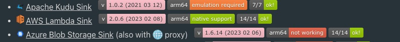

The badges are:

* : example works natively.
* : example **cannot work at all**. You will need to run it using AWS EC2 instance, see [playground ec2](/playground%20ec2) CLI command
* : example is working but emulation is required. 

Docker Desktop now provides **Rosetta 2** virtualization feature, see detailed steps [here](https://levelup.gitconnected.com/docker-on-apple-silicon-mac-how-to-run-x86-containers-with-rosetta-2-4a679913a0d5) on how to enable it, basically, you need to enable this:

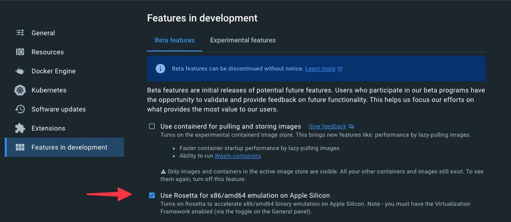

#### 🔽 Clone the repository

```bash
git clone --depth 1 https://github.com/vdesabou/kafka-docker-playground.git
```

> [!TIP]
> Specifying `--depth 1` only get the latest version of the playground, which reduces a lot the size of the download.

### ☁️ AWS EC2 instance (using Cloud Formation)

If you want to run the playground on an EC2 instance, you can use the AWS Cloud Formation [template](https://github.com/vdesabou/kafka-docker-playground/blob/master/cloudformation/kafka-docker-playground.yml).

More details [here](https://github.com/vdesabou/kafka-docker-playground/tree/master/cloudformation).

### ✨ AWS EC2 playground ec2 command

The [playground ec2](/playground%20ec2) CLI command creates and manages AWS EC2 instances (using Cloud Formation) to run kafka-docker-playground, and opens them directly in Visual Studio Code using Remote Development (over SSH).

It is what you want for an example that needs far more CPU or memory than you have, one that must run for hours, or one that does not work on arm64.

Main subcommands are `create`, `open`, `list`, `status`, `start`, `stop`, `delete`, `allow-my-ip`, `sync-repro-folder` and `push-secrets`: check [playground ec2](/playground%20ec2) for the full reference.

## 🦭 Using Podman instead of Docker

The playground can run on [Podman](https://podman.io) instead of Docker, with nothing to change in
the examples.

It always drives the container engine through the `docker` CLI and the `docker compose` plugin. With
Podman you keep both, and point them at the **rootful Podman socket** with `DOCKER_HOST`. The
playground detects it and adapts on its own:

- image builds use Podman's own builder (`DOCKER_BUILDKIT=0` is set automatically), so images patched
  locally, like the connect image with its extra tools, are used and kept
- bind mounts of `/tmp` use the resolved path, `/private/tmp` on macOS, which a Podman machine shares

Run `playground doctor` to check that your engine is ready. It is the one command that still works
when the engine is down.

```
$ playground doctor
🩺 Checking the container engine
✅ 'docker' CLI found: Docker version 29.8.1
🦭 engine detected: podman
✅ engine is reachable
✅ 'docker compose' is 5.5.1
✅ engine memory is 11GB
✅ builds use the classic builder (DOCKER_BUILDKIT=0)
✅ podman is running rootful
✅ podman network backend is netavark
✅ docker.io is in the podman search registries
✅ the podman machine shares /Users/me
✅ the podman machine shares /private
✅ the podman machine shares /var/folders
🩺 all good, the podman engine is ready for the playground
```

`playground status` also shows which engine is in use.

### 🍏 Setup on macOS

```bash
podman machine init --rootful --cpus 4 --memory 12288 --disk-size 100
podman machine start

export DOCKER_HOST="unix://$(podman machine inspect --format '{{.ConnectionInfo.PodmanSocket.Path}}')"

playground doctor
```

- The playground needs at least 8GB of memory.
- Do not pass any `-v` to `podman machine init`. The defaults share `/Users`, `/private` and
  `/var/folders`, which is what the playground mounts from, and any `-v` replaces them.
- An existing machine can be switched to rootful with
  `podman machine stop && podman machine set --rootful && podman machine start`.

### 🐧 Setup on Linux

```bash
# podman, plus netavark and aardvark-dns so that containers resolve each other by name
sudo apt-get install -y podman netavark aardvark-dns    # or: sudo dnf install -y podman

# rootful socket, made accessible to your user's group
sudo mkdir -p /etc/systemd/system/podman.socket.d
sudo tee /etc/systemd/system/podman.socket.d/99-playground.conf << EOF
[Socket]
ListenStream=
ListenStream=/run/podman-api/podman.sock
SocketMode=0660
SocketGroup=$(id -gn)
DirectoryMode=0755
EOF
sudo systemctl daemon-reload
sudo systemctl stop podman.service
sudo systemctl enable --now podman.socket
sudo systemctl restart podman.socket

export DOCKER_HOST="unix:///run/podman-api/podman.sock"

playground doctor
```

- The socket is moved out of `/run/podman`, which Podman creates as `0700 root`: a socket in there
  stays unreachable for a regular user whatever its own permissions.
- Use the **real compose v2 plugin**, not `podman-compose`. `podman-compose` is a separate
  reimplementation with only partial support for `profiles:` and `build:`, which the playground relies
  on heavily.
- No `docker` CLI on the machine? Install `docker-ce-cli` and `docker-compose-plugin` from Docker's
  repository; neither needs the Docker daemon.
- On distributions with SELinux enforcing (Fedora, RHEL), add this to
  `/etc/containers/containers.conf`, because the playground's bind mounts are not labelled:

  ```toml
  [containers]
  label = false
  ```

### 🔀 Switching between Docker and Podman

Once Podman is set up, instead of exporting `DOCKER_HOST`, you can use [playground switch-podman](/playground%20switch-podman): it creates a `podman` docker context, so the switch applies to your current shell and to new ones, with nothing to export (on macOS, the podman machine is started if needed).

[playground switch-docker](/playground%20switch-docker) restores the docker context that was active before. Both commands end with `playground doctor`.

> [!WARNING]
> Containers are not moved between engines: stop the running example first.

## 🏎️ Start an example

Check the list of examples in the **[Content](/content.md)** section and simply use [playground run](/playground%20run) CLI command!


> [!NOTE]
> When some environment variables are required, it is specified in the corresponding `README` file
> 
> Examples:
> 
> * [AWS S3 sink connector](https://github.com/vdesabou/kafka-docker-playground/tree/master/connect/connect-aws-s3-sink#aws-setup): file `~/.aws/credentials` or environment variables `AWS_REGION`, `AWS_ACCESS_KEY_ID` and `AWS_SECRET_ACCESS_KEY` are required.
> 
> * [Zendesk source connector](https://github.com/vdesabou/kafka-docker-playground/tree/master/connect/connect-zendesk-source#how-to-run): arguments `ZENDESK_URL`, `ZENDESK_USERNAME` and `ZENDESK_PASSWORD` are required (you can also pass them as environment variables)
>

If there are missing environment variables, you'll need to fix it:

[](https://asciinema.org/a/643687)

### 🔐 Storing credentials with playground secrets

Instead of exporting variables in every shell, store them once with [playground secrets](/playground%20secrets): `playground run` then loads automatically the ones the example declares.

```bash
playground secrets set SALESFORCE_PASSWORD    # 🔐 store it, prompted
playground secrets check -f <example>         # ✅ what is still missing
playground run -f <example>                   # 🚀 loaded for you
```

They are stored in `~/.config/kafka-docker-playground` (never in the repository), with credential values kept in a backend such as macOS Keychain, secret-tool, pass, 1Password or HashiCorp Vault (see [playground secrets backend](/playground%20secrets%20backend)).

## 🌤️ Confluent Cloud examples

Simply use [playground run](/playground%20run) command !

[](https://asciinema.org/a/643690)

All you have to do is to be already logged in with [confluent CLI](https://docs.confluent.io/confluent-cli/current/overview.html#confluent-cli-overview).

By default, a new Confluent Cloud environment with a Cluster will be created.

You can configure the new cluster by using flags with [playground run](/playground%20run) command or just by setting environment variables:

* `--cluster-type` (or `CLUSTER_TYPE` environment variable): the type of cluster (possible values: `basic`, `standard` and `dedicated`, default `basic`)
* `--cluster-cloud` (or `CLUSTER_CLOUD` environment variable): The Cloud provider (possible values: `aws`, `gcp` and `azure`, default `aws`)
* `--cluster-region` (or `CLUSTER_REGION` environment variable): The Cloud region (use `confluent kafka region list` to get the list, default `eu-west-2` for aws, `westeurope` for azure and `europe-west2` for gcp)
* `--cluster-environment` (or `ENVIRONMENT` environment variable) (optional): The environment id where want your new cluster (example: `txxxxx`) 

In case you want to use your own existing cluster, you need to setup, in addition to previous ones:

* `--cluster-name` (or `CLUSTER_NAME` environment variable): The cluster name
* `--cluster-creds` (or `CLUSTER_CREDS` environment variable): The Kafka api key and secret to use, it should be separated with colon (example: `<API_KEY>:<API_KEY_SECRET>`)
* `--cluster-schema-registry-creds` (or `SCHEMA_REGISTRY_CREDS` environment variable) (optional, if not set, new one will be created): The Schema Registry api key and secret to use, it should be separated with colon (example: `<SR_API_KEY>:<SR_API_KEY_SECRET>`)

🤖 For [Fully Managed connectors](/content?id=%f0%9f%a4%96-fully-managed-connectors), as examples are [dependent of cloud providers](https://docs.confluent.io/cloud/current/connectors/index.html#cloud-platforms-support), you have the possibility to define specific existing clusters per cloud provider:

* AWS:

```bash
AWS_CLUSTER_NAME
AWS_CLUSTER_REGION
AWS_CLUSTER_CLOUD
AWS_CLUSTER_CREDS
```

* GCP:

```bash
GCP_CLUSTER_NAME
GCP_CLUSTER_REGION
GCP_CLUSTER_CLOUD
GCP_CLUSTER_CREDS
```

* AZURE:

```bash
AZURE_CLUSTER_NAME
AZURE_CLUSTER_REGION
AZURE_CLUSTER_CLOUD
AZURE_CLUSTER_CREDS
```

For example, if you're running an AZURE Fully Managed connector example and `AZURE_CLUSTER_NAME` is set, then this cluster will be used even if you have `CLUSTER_NAME` set.

## 🪄 Specify versions

[playground run](/playground%20run) command allows you to do that very easily !

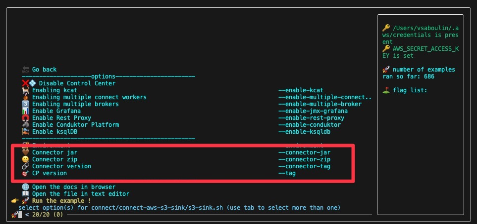

### 🎯 For Confluent Platform (CP)

By default, the latest Confluent Platform version supported by the playground is used (currently CP 8.3.2, which is [KRaft](/how-to-use?id=🛰-kraft-mode) only). Use `--tag` option of [playground run](/playground%20run) (or `TAG` environment variable) to run with another version.

> [!TIP]
> You can also change cp version while running an example using [playground update-version](/playground%20update-version)

### 🔗 For Connectors

By default, for each connector, the latest available version on [Confluent Hub](https://www.confluent.io/hub/) is used. 

The only 2 exceptions are:

* replicator which is using same version as CP (but you can force a version using `REPLICATOR_TAG` environment variable)
* JDBC which is using same version as CP (but only for CP version lower than 6.x)

Each latest version used is specified on the [Connectors list](/content?id=%f0%9f%94%97-connectors).

The playground has 3 different ways to use different connector version when running a connector example:

1. Specify the connector version (`--connector-tag` using [playground run](/playground%20run) command)

2. Specify a connector ZIP file (`--connector-zip` using [playground run](/playground%20run) command)

3. Specify a connector JAR file (`--connector-jar` using [playground run](/playground%20run) command)

*Example:*

```bash
00:33:47 ℹ️ 🎯 CONNECTOR_JAR is set with /tmp/kafka-connect-http-1.3.1-SNAPSHOT.jar
/usr/share/confluent-hub-components/confluentinc-kafka-connect-http/lib/kafka-connect-http-1.2.4.jar
00:33:48 ℹ️ 👷 Building Docker image confluentinc/cp-server-connect-base:cp-6.2.1-kafka-connect-http-1.2.4-kafka-connect-http-1.3.1-SNAPSHOT.jar
00:33:48 ℹ️ Remplacing kafka-connect-http-1.2.4.jar by kafka-connect-http-1.3.1-SNAPSHOT.jar
```

When jar to replace cannot be found automatically, the user is able to select the one to replace automatically:

```bash
11:02:43 ℹ️ 🎯 CONNECTOR_JAR is set with /tmp/debezium-connector-postgres-1.4.0-SNAPSHOT.jar
ls: cannot access '/usr/share/confluent-hub-components/debezium-debezium-connector-postgresql/lib/debezium-connector-postgresql-1.4.0.jar': No such file or directory
11:02:44 ❗ debezium-debezium-connector-postgresql/lib/debezium-connector-postgresql-1.4.0.jar does not exist, the jar name to replace could not be found automatically
11:02:45 ℹ️ Select the jar to replace:
1) debezium-api-1.4.0.Final.jar
2) debezium-connector-postgres-1.4.0.Final.jar
3) debezium-core-1.4.0.Final.jar
```

> [!WARNING]
> You can use both `--connector-tag` and `--connector-jar` at same time (along with `--tag`), but `--connector-tag` and `--connector-zip` are mutually exclusive.

> [!NOTE]
> For more information about the Connect image used, check [here](/how-it-works?id=🔗-connect-image-used).

> [!TIP]
> You can also change connector(s) version(s) while running an example using [playground update-version](/playground%20update-version)

## 🐳 Overriding Confluent Platform Docker images and tags

Docker images being used can be overridden by exporting following environment variables:

* zookeeper (`CP_ZOOKEEPER_IMAGE`) (CP < 8 only)
* kafka (`CP_KAFKA_IMAGE`)
* connect (`CP_CONNECT_IMAGE`)
* schema-registry (`CP_SCHEMA_REGISTRY_IMAGE`)
* control-center (`CP_CONTROL_CENTER_IMAGE`)
* ksqlDb (`CP_KSQL_IMAGE`)
* ksqlDB CLI (`CP_KSQL_CLI_IMAGE`)
* rest-proxy (`CP_REST_PROXY_IMAGE`)

Docker images tags being used can be overridden by exporting following environment variables:

* zookeeper (`CP_ZOOKEEPER_TAG`) (CP < 8 only)
* kafka (`CP_KAFKA_TAG`)
* connect (`CP_CONNECT_TAG`) (`--connect-tag` using [playground run](/playground%20run) command)
* schema-registry (`CP_SCHEMA_REGISTRY_TAG`)
* control-center (`CP_CONTROL_CENTER_TAG`)
* ksqlDb (`CP_KSQL_TAG`)
* ksqlDB CLI (`CP_KSQL_CLI_TAG`)
* rest-proxy (`CP_REST_PROXY_TAG`)

## 🛰 Kraft mode

[Kraft](https://docs.confluent.io/platform/current/kafka-metadata/kraft.html) is enabled by default when used with CP 8+, but you can also force it by setting environment variable `ENABLE_KRAFT` (minimum CP version supported is 7.4)

In Kraft mode, a `controller` container replaces the `zookeeper` container (its JMX port is `10005`). ZooKeeper is only used with CP < 8 when `ENABLE_KRAFT` is not set.

## ⛳ Options

Selecting options is really easy with [playground run](/playground%20run) menu:

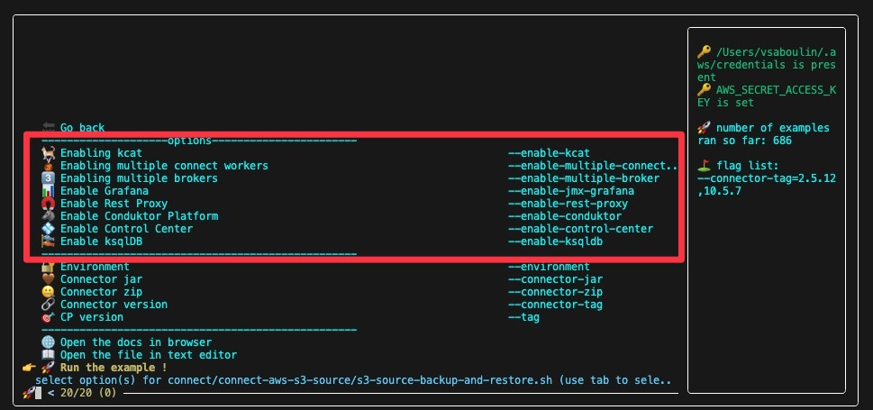

### 🚀 Enabling ksqlDB

By default, `ksqldb-server` and `ksqldb-cli` containers (see [`environment/plaintext/docker-compose.yml`](https://github.com/vdesabou/kafka-docker-playground/blob/master/environment/plaintext/docker-compose.yml)) are not started for every test.

You can enable this with `--enable-ksqldb` option of [playground run](/playground%20run) or by setting environment variable `ENABLE_KSQLDB=1` in your shell.

### 💠 Enabling Control Center

By default, `control-center` container (see [`environment/plaintext/docker-compose.yml`](https://github.com/vdesabou/kafka-docker-playground/blob/master/environment/plaintext/docker-compose.yml)) is not started for every test.

You can enable this with `--enable-control-center` option of [playground run](/playground%20run) or by setting environment variable `ENABLE_CONTROL_CENTER=1` in your shell.

Control Center "Next Gen" (image `confluentinc/cp-enterprise-control-center-next-gen`) is used by default. If you want to use legacy image, you can enable it by setting environment variable `ENABLE_LEGACY_CONTROL_CENTER=1` in your shell.

Control Center is reachable at http://127.0.0.1:9021

### 🐺 Enabling Conduktor Platform

By default, [`Conduktor Platform`](https://www.conduktor.io) container is not started for every test. 

You can enable this with `--enable-conduktor` option of [playground run](/playground%20run) or by setting environment variable `ENABLE_CONDUKTOR=1` in your shell.

Conduktor is reachable at [http://127.0.0.1:8080/console](http://127.0.0.1:8080/console) (`admin`/`admin`).

### 🧲 Enabling REST Proxy

By default, `rest-proxy` container is not started for every test.

You can enable this with `--enable-rest-proxy` option of [playground run](/playground%20run).

### 3️⃣ Enabling multiple brokers

By default, there is only one kafka node enabled. To enable three nodes, select it in menu or use `--enable-multiple-brokers` option of [playground run](/playground%20run).

### 🥉 Enabling multiple connect workers

By default, there is only one connect node enabled. To enable three connect nodes, select it in menu or use `--enable-multiple-connect-workers` option of [playground run](/playground%20run).

### 🌪️ Enabling SQL Datagen

For Oracle, MySQL, Postgres and Microsoft SQL Server source connector examples (JDBC and Debezium), `--enable-sql-datagen` option of [playground run](/playground%20run) starts inserting rows at the end of the example.

### 🎯 Starting only some services

Set environment variable `START_SERVICES` with a space-separated list of services (example: `START_SERVICES="broker schema-registry connect"`) to start only those services of the environment.

### 📊 Enabling JMX Grafana

By default, Grafana dashboard using JMX metrics is not started for every test.

You can enable this with `--enable-jmx-grafana` option of [playground run](/playground%20run) or by setting environment variable `ENABLE_JMX_GRAFANA=1` in your shell.

📊 Grafana is reachable at [http://127.0.0.1:3000](http://127.0.0.1:3000)
🛡️ Prometheus is reachable at [http://127.0.0.1:9090](http://127.0.0.1:9090)
📛 [Pyroscope](https://pyroscope.io/docs/) is reachable at [http://127.0.0.1:4040](http://127.0.0.1:4040)

#### Grafana dashboards

List of provided dashboards:
 - Confluent Platform overview
 - Zookeeper cluster (CP < 8 only)
 - Kafka cluster
 - Kafka topics
 - Kafka quotas
 - Schema Registry cluster
 - Kafka Connect cluster
 - ksqlDB cluster
 - Kafka streams RocksDB
 - Kafka Clients
 - Oracle CDC source Connector
 - Oracle XStream CDC source Connector
 - Debezium CDC source Connectors
 - Mongo source and sink Connector
 - Kafka lag exporter (no screenshot)
 - Cluster Linking (no screenshot)
 - Flink (no screenshot)


<!-- tabs:start -->

#### **Confluent Platform overview**

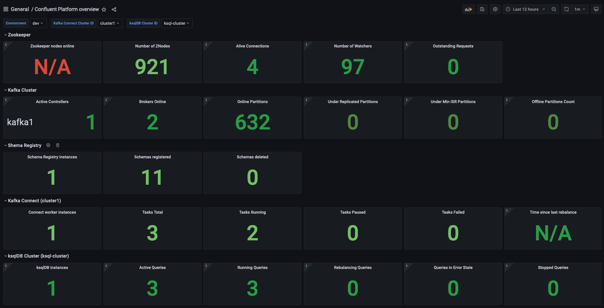

#### **Zookeeper cluster (CP < 8 only)**

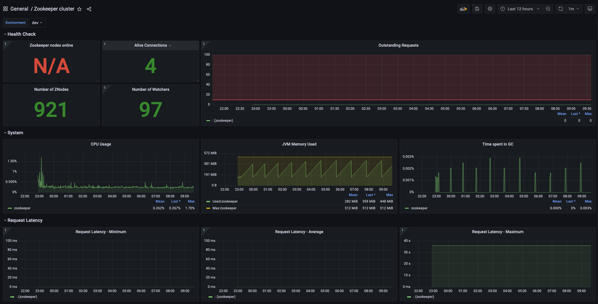

#### **Kafka cluster**

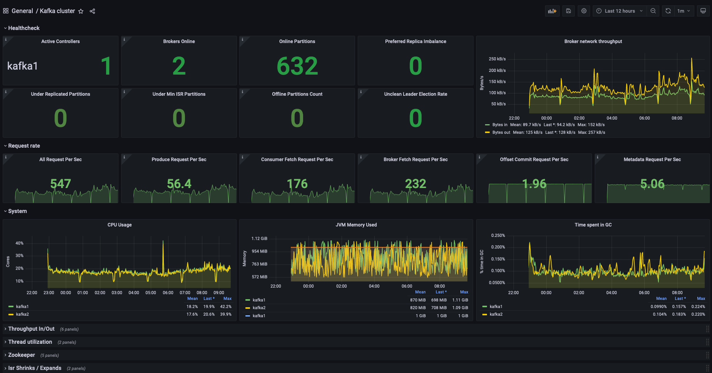
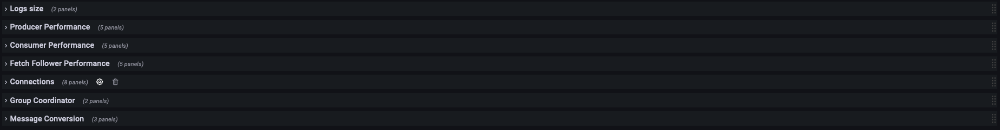

#### **Kafka topics**

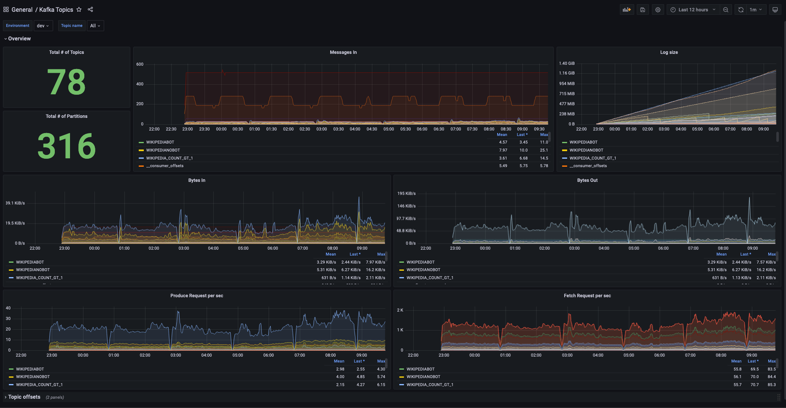

#### **Kafka quotas**

For Kafka to output quota metrics, at least one quota configuration is necessary.

A quota can be configured using:

```bash
docker exec broker kafka-configs --bootstrap-server broker:9092 --alter --add-config 'producer_byte_rate=10000,consumer_byte_rate=30000,request_percentage=0.2' --entity-type users --entity-name unknown --entity-type clients --entity-name unknown
```

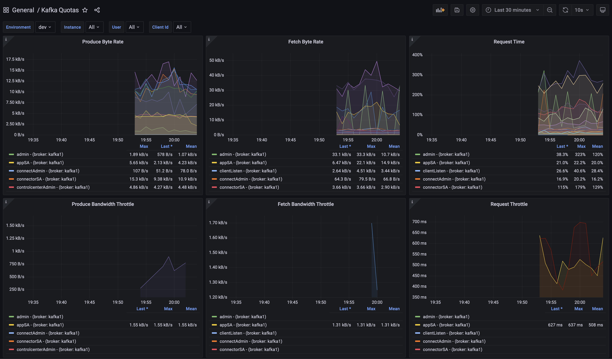

#### **Schema Registry cluster**

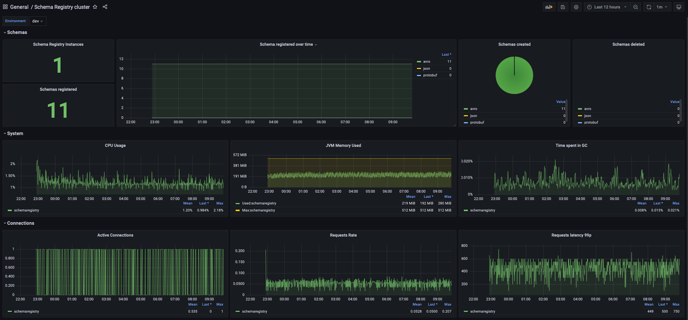

#### **Kafka Connect cluster**

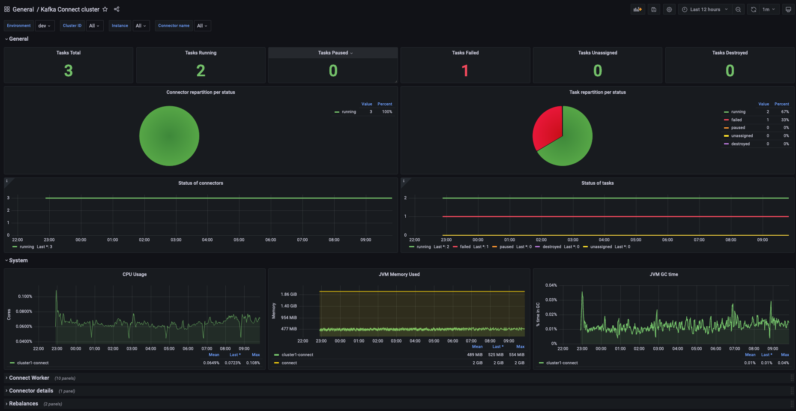
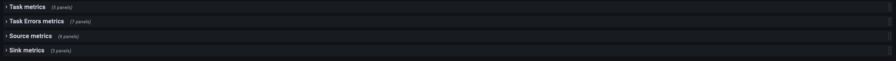

#### **ksqlDB cluster**

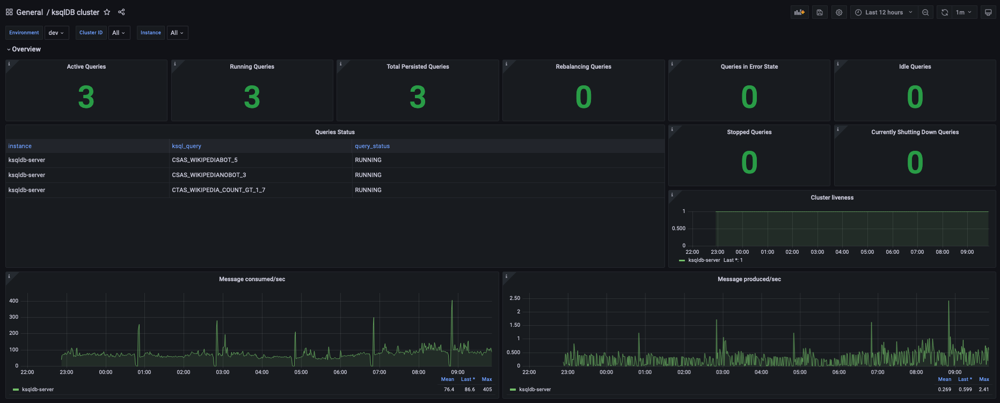
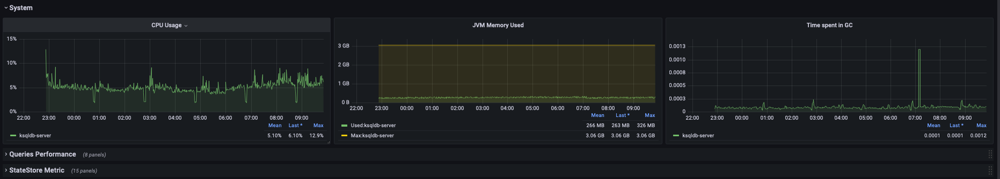

#### **Kafka streams RocksDB**

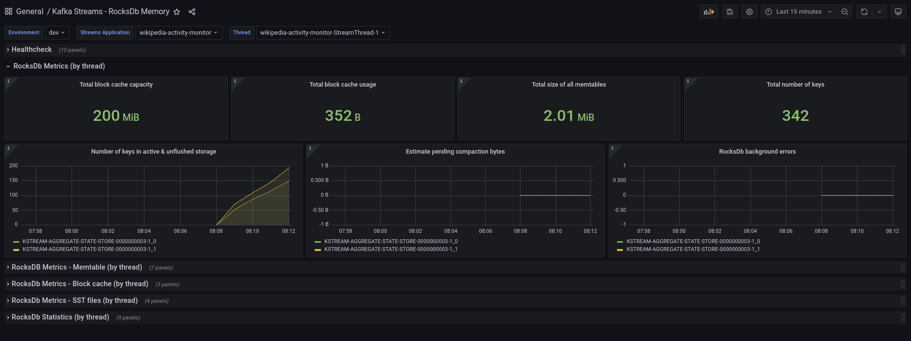

#### **Kafka Clients**

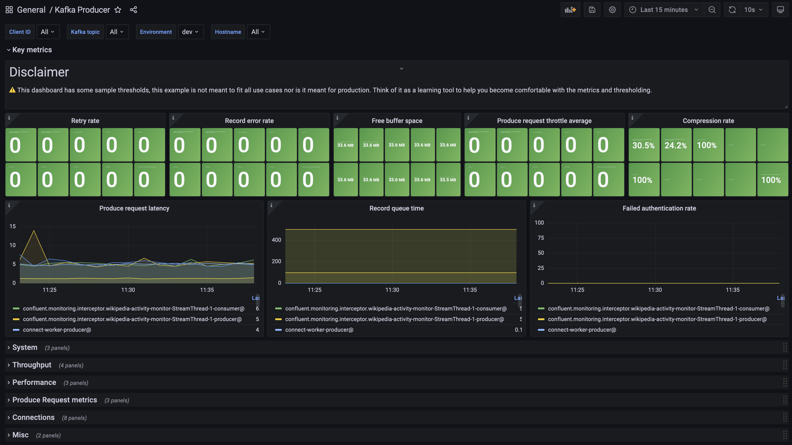

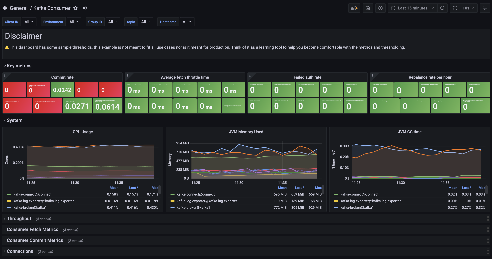

#### **Oracle CDC source Connector**

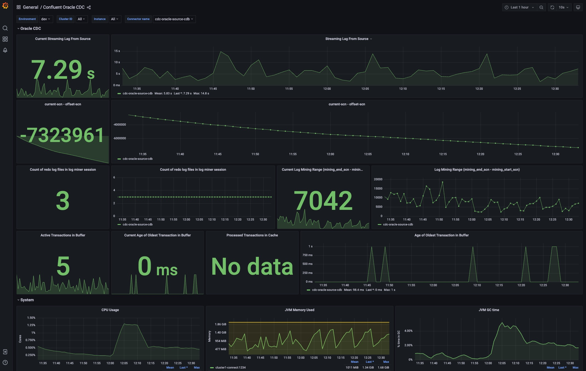

#### **Oracle XStream CDC source Connector**

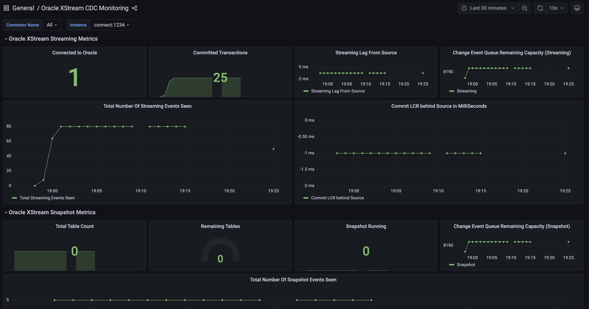

#### **Debezium CDC source Connectors**

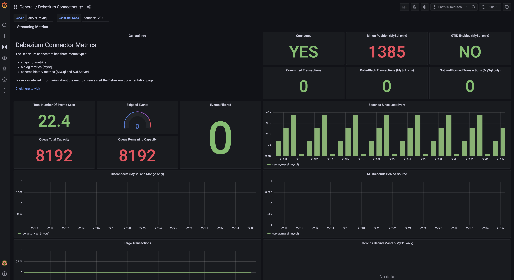

#### **Mongo source and sink Connector**

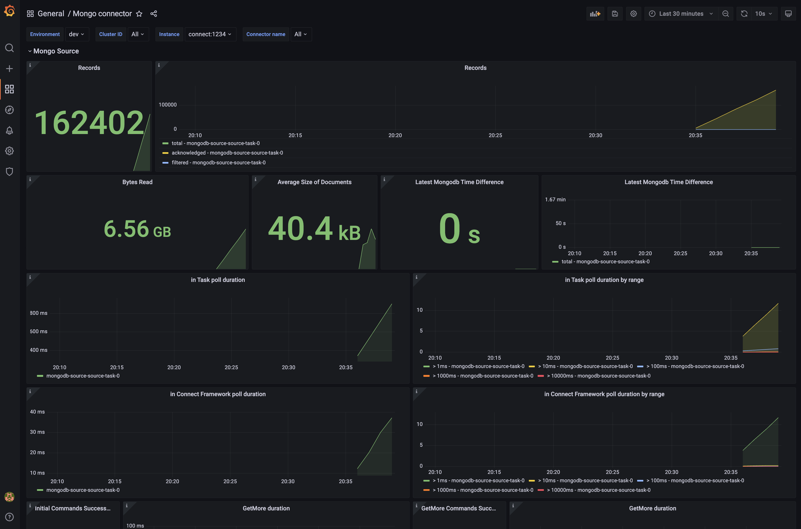

<!-- tabs:end -->


### 🐈‍⬛ Enabling kcat

By default, [edenhill/kcat](https://github.com/edenhill/kcat) is not started for every test. 

You can enable this with `--enable-kcat` option of [playground run](/playground%20run) or by setting environment variable `ENABLE_KCAT=1` in your shell.

Then you can use it with:

```bash
docker exec kcat kcat -b broker:9092 -L
```

### 🐿️ Enabling Flink

By default, Flink task/jobmanager is not started for every test. 

You can enable Flink for any connector using plaintext deployment with `--enable-flink` option of [playground run](/playground%20run) or by setting environment variable `ENABLE_FLINK=1` in your shell. 

Once enabled, the CLI will ask if you need to download any connectors. Based on the response, you can download one or more connectors from Flink's [maven](https://repo.maven.apache.org/maven2/org/apache/flink/) repository. 

Additionally, you can start Flink in any of the available [deployment modes](https://nightlies.apache.org/flink/flink-docs-master/docs/deployment/overview/#deployment-modes) by navigating to the respective directory:

- `kafka-docker-playground/`
  - `flink/`
    - `flink_app_mode/start.sh`
    - `flink_session_mode/start.sh`
    - `flink_session_sql_mode/start.sh`


🐿️ Flink UI is reachable using [http://127.0.0.1:8081](http://127.0.0.1:8081) within the flink child directory. If you enable Flink by starting connector deployment, [http://127.0.0.1:18081](http://127.0.0.1:18081) will be used. 

## 🔢 JMX Metrics

JMX metrics are available locally on those ports:

* broker: `10000` (`broker2`: `12000`, `broker3`: `13000` with multiple brokers)
* schema-registry: `10001`
* connect: `10002` (`connect2`: `10022`, `connect3`: `10032` with multiple connect workers)
* ksqldb-server: `10003`
* controller: `10005` (Kraft mode)
* zookeeper: `9999` (CP < 8 only)

In order to easily gather JMX metrics, you can use [playground get-jmx-metrics](/playground%20get-jmx-metrics) command. `--container` (`-c`) can be repeated (default is `connect`), `--domain` (`-d`) restricts the list of domains and `--open` (`-o`) saves the output to a file and opens it with your editor:

```bash
playground get-jmx-metrics -c connect -c broker --domain "kafka.server"
```

Example (without specifying domain):

```bash
$ playground get-jmx-metrics -c connect
17:35:35 ❗ You did not specify a list of domains, all domains will be exported!
17:35:35 ℹ️ This is the list of domains for component connect
JMImplementation
com.sun.management
java.lang
java.nio
java.util.logging
jdk.management.jfr
kafka.admin.client
kafka.connect
kafka.consumer
kafka.producer
17:35:38 ℹ️ JMX metrics are available in /tmp/jmx_metrics.log file
```

Example (specifying domain):

```bash
$ playground get-jmx-metrics -c connect -d "kafka.connect kafka.consumer kafka.producer"
17:38:00 ℹ️ JMX metrics are available in /tmp/jmx_metrics.log file
```

> [!WARNING]
> Local install of Java `JDK` (at least 1.8) is required to run `playground get-jmx-metrics`

## 📝 See properties file

Because the playground uses **[Docker override](/how-it-works?id=🐳-docker-override)**, not all configuration parameters are in same `docker-compose.yml` file.

In order to easily see the end result properties file, you can use [playground container get-properties](/playground%20container%20get-properties) command

*Example:*

```bash
$ playground get-properties -c connect
bootstrap.servers=broker:9092
config.providers.file.class=org.apache.kafka.common.config.provider.FileConfigProvider
config.providers=file
config.storage.replication.factor=1
config.storage.topic=connect-configs
connector.client.config.override.policy=All
consumer.confluent.monitoring.interceptor.bootstrap.servers=broker:9092
consumer.interceptor.classes=io.confluent.monitoring.clients.interceptor.MonitoringConsumerInterceptor
group.id=connect-cluster
internal.key.converter.schemas.enable=false
internal.key.converter=org.apache.kafka.connect.json.JsonConverter
internal.value.converter.schemas.enable=false
internal.value.converter=org.apache.kafka.connect.json.JsonConverter
key.converter=org.apache.kafka.connect.storage.StringConverter
log4j.appender.stdout.layout.conversionpattern=[%d] %p %X{connector.context}%m (%c:%L)%n
log4j.loggers=org.apache.zookeeper=ERROR,org.I0Itec.zkclient=ERROR,org.reflections=ERROR
offset.storage.replication.factor=1
offset.storage.topic=connect-offsets
plugin.path=/usr/share/confluent-hub-components/confluentinc-kafka-connect-http
producer.client.id=connect-worker-producer
producer.confluent.monitoring.interceptor.bootstrap.servers=broker:9092
producer.interceptor.classes=io.confluent.monitoring.clients.interceptor.MonitoringProducerInterceptor
rest.advertised.host.name=connect
rest.port=8083
status.storage.replication.factor=1
status.storage.topic=connect-status
topic.creation.enable=true
value.converter.schema.registry.url=http://schema-registry:8081
value.converter.schemas.enable=false
value.converter=io.confluent.connect.avro.AvroConverter
```

## ♻️ Re-create containers

Because the playground uses **[Docker override](/how-it-works?id=🐳-docker-override)**, not all configuration parameters are in same `docker-compose.yml` file and also `docker-compose` files in the playground depends on environment variables to be set.

For these reasons, if you want to make a change in one of the `docker-compose` files (without restarting the example from scratch), it is not simply a matter of doing `docker compose up -d` 😅!

However, when you execute an example, you get in the output the [playground container recreate](/playground%20container%20recreate) in order to easily re-create modified container(s) 🥳.

*Example:*

```bash
12:02:18 ℹ️ ✨If you modify a docker-compose file and want to re-create the container(s),
 run cli command playground container recreate
```

So you can modify one of the `docker-compose` files (in that case either [`environment/plaintext/docker-compose.yml`](https://github.com/vdesabou/kafka-docker-playground/blob/master/environment/plaintext/docker-compose.yml) or [`connect/connect-http-sink/docker-compose.plaintext.yml`](https://github.com/vdesabou/kafka-docker-playground/blob/master/connect/connect-http-sink/docker-compose.plaintext.yml)), and then run [playground container recreate](/playground%20container%20recreate) command:

```bash
playground container recreate
```

Only the containers whose definition changed (for example `connect` and `http-service-no-auth` after editing [`connect/connect-http-sink/docker-compose.plaintext.yml`](https://github.com/vdesabou/kafka-docker-playground/blob/master/connect/connect-http-sink/docker-compose.plaintext.yml)) are re-created, the others are left running.
